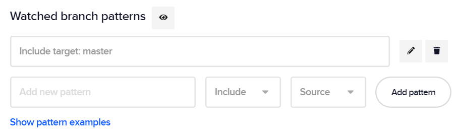
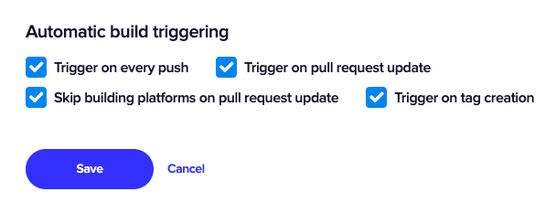

In order to fully automate your CI/CD pipeline, you can set up automatic build triggering by configuring which branches to track and when to trigger builds.

Build triggers can be configured in **App settings > Build triggers**.

## Tracking specific branches

The branches tracked for building are selected by entering branch patterns and including or excluding the matching branches. Note that you can either enter the exact name of the branch to select it or use the wildcard symbols listed in the table below to select more than one branch with one pattern.

The first (i.e. topmost) pattern in the list is applied first. Each following pattern will limit the set of branches further. In the case of conflicting patterns, the latter one will prevail. You can check the targeted branches by clicking the eye icon next to **Watched branch patterns**.

To add a new branch pattern:

1. Navigate to **App settings >** **Build triggers**.
2. Enter a pattern matching the name of one or more branches in the project.
3. Select **Include** or **Exclude** from the dropdown to limit the set of targeted branches by either including or excluding the matching branches.
4. For pull request builds, select whether the tracked branch is the **Source** or the **Target** branch of the pull request. This setting has no effect on other types of builds.
5. Click **Add pattern** to save it. You can always edit or delete added patterns.
6. Click **Save** at the end of the section for the changes to take effect.

## Build triggers

Under Automatic build triggering, you can select when to trigger builds.

**Trigger on every push**. When checked, a build will be started every time you commit code to any of the tracked branches.

**Trigger on pull request update** (not supported for apps from custom sources). When checked, your workflow is run when a pull request is opened or updated.

**Skip building platforms on pull request update**. When checked, only tests are run for the opened or updated pull request (merge request in GitLab jargon) without building for platforms. When unchecked, we build for platforms and generate artifacts but publishing to app stores is not available.

**Trigger on tag creation**. When checked, Codemagic will automatically build the tagged commit whenever you create a tag for this app. Note that the watched branch settings have no effect on tag builds.

If you don't check any of these triggering options, you will have to run builds manually for this workflow.

## Webhooks

For accounts with sufficient permissions, Codemagic creates the webhooks necessary for automatic build triggering during the initial build run. However, in some cases, such as when you add an app from a custom source, you may have to manually set up the webhook to enable automatic builds in response to events in the repository.

To set up a webhook for automatic build triggering on Codemagic, you must register the Codemagic **payload URL** in your repository settings and select Repository push, Branch push and PR merge events.

{}
The payload URL has the following format:  
`https://api.codemagic.io/hooks/[yourappID]`
{}

You can find your app ID in the browser URL after `app/` when you open the app on Codemagic: `https://codemagic.io/app/[yourappID]`

## Skipping builds

If you do not wish Codemagic to build a particular commit, include `[skip ci]` or `[ci skip]` in your commit message.
