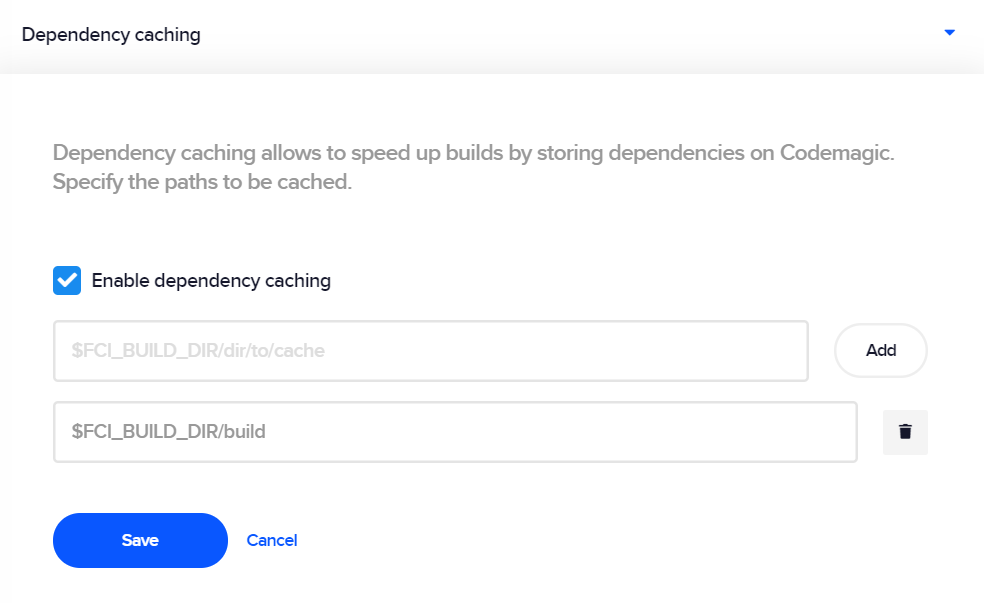

---
categories:
  - Build configuration
description: Store your dependencies on Codemagic for a faster build time.
title: Dependency caching
weight: 6
---

You can speed up your builds by storing dependencies on Codemagic. To use caching, you must **enable dependency caching** in app settings. Note that caching is workflow-specific.

By default, Codemagic offers to cache the following path:

`$FCI_BUILD_DIR/build`

You can add other paths to be cached, for example:

| **Path**                                    | **Description**                                  |
| ------------------------------------------- | ------------------------------------------------ |
| `$FCI_BUILD_DIR/build`                      | Build cache                                      |
| `$HOME/.pub-cache`                          | Dart cache                                       |
| `$HOME/Library/Developer/Xcode/DerivedData` | Xcode cache                                      |
| `$HOME/.gradle/caches`                      | Gradle cache. Note: do not cache `$HOME/.gradle` |

## Enabling dependency caching

1. In your app settings, open the **Dependency caching** section.

   

2. Check the **Enable dependency caching** option. By default, caching is disabled.
3. Enter the path(s) to the dependencies to be cached and click **Add**. Note that you can delete added paths anytime.
4. Click **Save** to save the settings.
