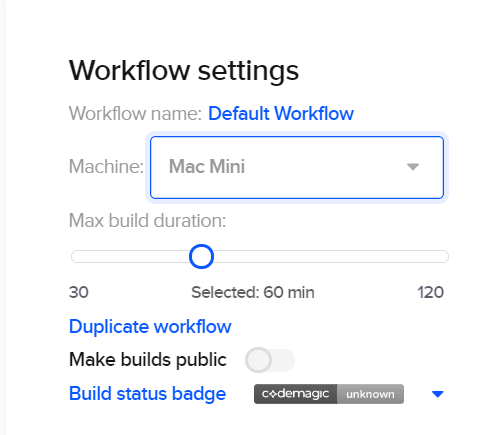

You can choose between Mac Mini or Mac Pro when running the build. Specifications for these machines are available [here](../releases-and-versions/versions/#hardware). The machine type can be chosen in the drop-down menu on the right of the screen, under the workflow settings.
>Mac Pro machines are available for teams and users that have enabled billing in team or user settings respectively.