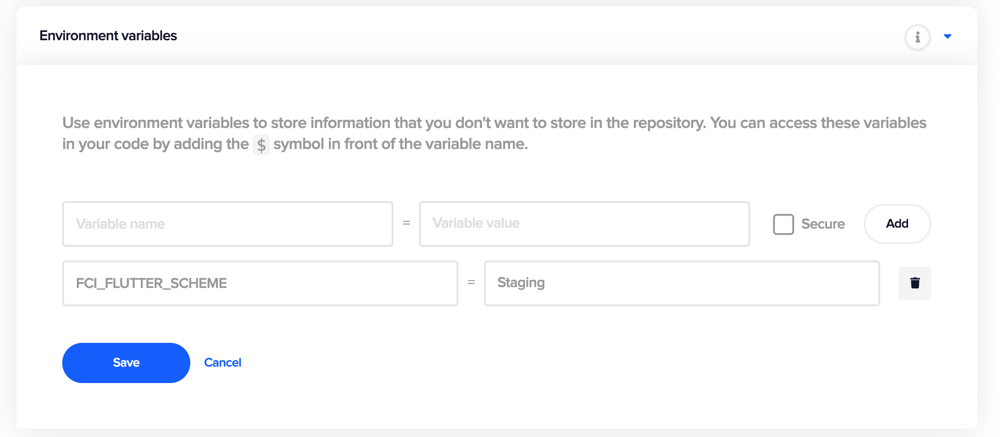

By default, Codemagic builds the iOS app using the `Runner` scheme. You can specify a custom iOS scheme for the `xcodebuild` command with the `FCI_FLUTTER_SCHEME` environment variable. A different iOS scheme can be specified for each workflow.

For example, to change default scheme to custom scheme named `Staging`



Don't forget to click **Save** after adding the variable.



You can read more about environment variables and how to use them in the [Environment variables](https://docs.codemagic.io/building/environment-variables/) section.
