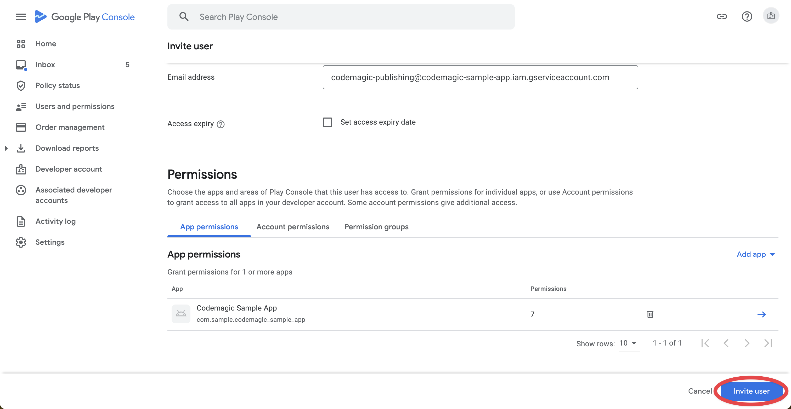

Codemagic enables you to automatically publish your app to the **internal**, **alpha**, **beta** and **production** tracks on Google Play. To do so, you must first [set up Android code signing](../code-signing/android-code-signing/ 'Android code signing') and then configure publishing to Google Play.


**Note:** This guide only applies to workflows configured with the **Flutter workflow editor**. If your workflow is configured with **codemagic.yaml** please go to [Publishing to Google Play using codemagic.yaml](../yaml-publishing/google-play).


## Requirements

1. Setting up access using Google Play API as shown below.
2. A **service account in Google Play Console** to obtain the **JSON credentials file**
3. Granting the necessary App permissions and access permissions to the service account.
4. You must build the app in **release mode** and set up **Android code signing**. You can check it [here](../flutter/flutter-projects/#building-android-app-bundles).

Before releasing the app to Google Play, ensure that it meets [Google Play's best practices guidelines](https://developer.android.com/distribute/best-practices/launch/).

## Setting up Google Play API access
To allow Codemagic to publish applications to Google Play, it is necessary to set up access using Google Play API.

1. Open your app's project on the [Google Cloud Console](https://console.cloud.google.com/) (or create a new one [here](https://console.cloud.google.com/projectcreate) if necessary).

2. Enable the [Google Play Android Developer API](https://console.developers.google.com/apis/api/androidpublisher.googleapis.com/).

   

3. Create a new service account from **CREATE CREDENTIALS** on the [Credentials menu page](https://console.cloud.google.com/apis/credentials).

   

4. In Step 1, enter the account name and description.

   

5. In Step 2, select the **Service Accounts > Service Account User** role.

   

6. Step 3 is unnecessary, so complete it by clicking **Done**.

   

7. Open the edit page from the **Actions** column of the created service account.

   

8. From the **KEYS** tab page, click on **ADD KEY > Create new key**.

   

9. Select **JSON** as the Key type and create a new key.

   

10. The private key for this service account will be downloaded. Please store it in a safe place as it will be necessary later for the Codemagic configuration.

    

11. Once you've completed this, let's move to the [Google Play Console](https://play.google.com/console).
12. Click on **Invite new users** on the **Users and permissions** page.

    

13. For the **Email address**, enter the one for the service account you just created.

    

14. From the **Add app**, select the target app.

    

15. Grant permissions for the **Releases** section (the rest of the settings can be left as default), and click **Apply**.

    

16. invite the service account by clicking **Invite user**.

    
## Setting up publishing to Google Play on Codemagic

Once you make all the preparations as described [above](../publishing/publishing-to-google-play/#requirements) and configure publishing to Google Play, Codemagic will automatically distribute the app to Google Play every time you build the workflow.


**Note:** The very first version of the app must be added to Google Play manually. You can download the **app_release.aab** from the build artifacts. In addition, each uploaded binary must have a different version; see how to automatically [increment build version](../building/build-versioning/ 'Build versioning') on Codemagic.


1. Navigate to the Distribution section in app settings.
2. Click **Google Play** to expand the option.
3. Upload your credentials JSON file.
4. Select a **track** for publishing.
   - Internal --- publish for internal testing and QA
   - Alpha --- publish for testing with a small group of trusted users
   - Beta --- publish for testing to a wider set of users
   - Production --- release the app to production
   - Custom --- release the app to a custom closed testing track
5. If you want to publish to a custom track, enter the custom track name.
6. If your application supports [in-app updates](https://developer.android.com/guide/playcore/in-app-updates), set the desired priority. If not, select **Default**.
7. In case you want to release a [staged version](https://support.google.com/googleplay/android-developer/answer/6346149?hl=en) of your application, which reaches only a fraction of users, set **Rollout fraction** to a value between 0 and 1. To release to everyone, leave the value empty.
8. If you are getting the next error: `Changes cannot be sent for review automatically. Please set the query parameter changesNotSentForReview to true`, mark the checkbox **Do not send changes for review**.

   But if the checkbox is marked and the app is sent for review automatically, you will get the error `Changes are sent for review automatically. The query parameter changesNotSentForReview must not be set.`
9. In case you want to upload the artifacts generated in the build to Google Play as a draft release, select **Submit release as draft**. Note that you cannot set the rollout fraction for draft releases.
10. If you want to publish the .apk even when one or more tests fail, mark the **Publish even if tests fail** checkbox.
11. Select **Enable Google Play publishing** at the top of the section to enable publishing.


**Note:** You can use the "**Wear OS Only**" track to manage Wear OS releases in Play Console. To target "**Wear OS Only**" track, add **wear:** in the track name.
