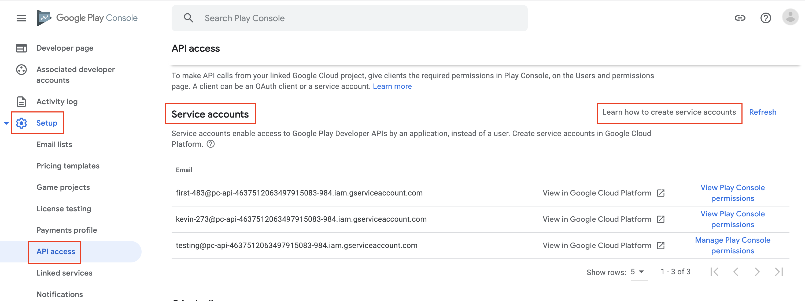
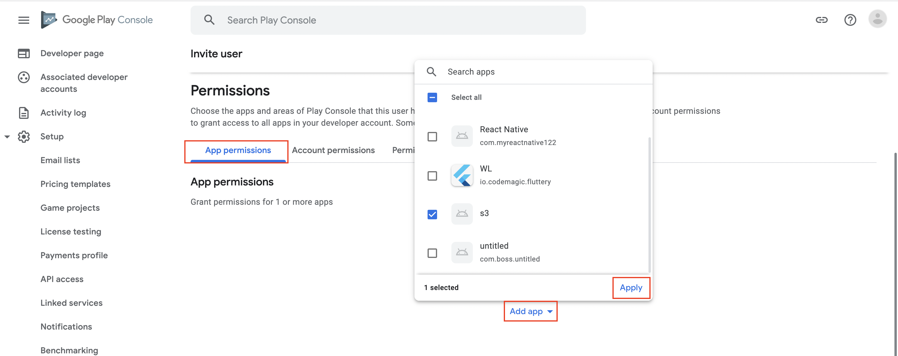
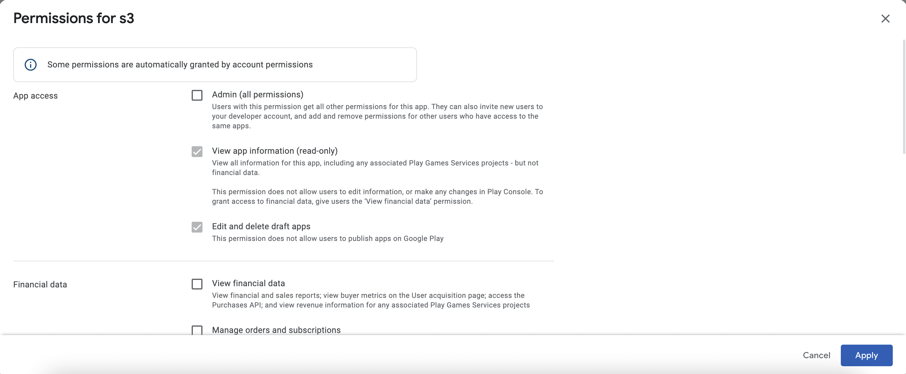
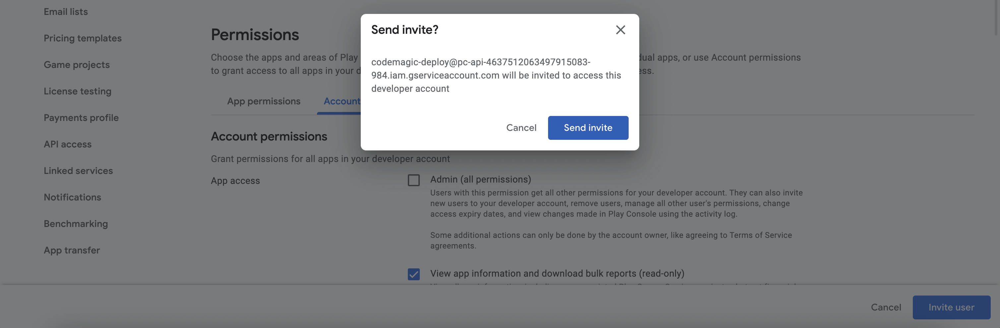

Codemagic enables you to automatically publish your app to the **internal**, **alpha**, **beta** and **production** tracks on Google Play. To do so, you must first [set up Android code signing](../code-signing/android-code-signing/ 'Android code signing') and then configure publishing to Google Play.


**Note:** This guide only applies to workflows configured with the **Flutter workflow editor**. If your workflow is configured with **codemagic.yaml** please go to [Publishing to Google Play using codemagic.yaml](../yaml-publishing/google-play).


## Requirements

1. Setting up access using Google Play API as shown below.
2. A **service account in Google Play Console** to obtain the **JSON credentials file**
3. Granting the necessary App permissions and access permissions to the service account.
4. You must build the app in **release mode** and set up **Android code signing**. You can check it [here](../flutter/flutter-projects/#building-android-app-bundles).

Before releasing the app to Google Play, ensure that it meets [Google Play's best practices guidelines](https://developer.android.com/distribute/best-practices/launch/).

## Setting up Google Play API access

1. To allow Codemagic to publish applications to Google Play, it is necessary to set up access using Google Play API. 

2. In the Google Play Console, navigate to **Setup > API access** and click **Learn how to create service accounts**.  
.  This will lead you to the **Google Cloud Platform**. 

3. In step 1, fill in the **Service account details** and click **Create**. The name of the service account will allow you to identify it among other service accounts you may have created.

4. In step 2, click the **Select a role** dropdown menu and choose the role. In this example we will use **Service Account User** as the desired role. Start typing the name of the role that you wish to add.  

5. In step 3, you can leave the fields blank and click **Done**.

6. In the list of created service accounts, identify the account you have just created and click on the menu in the **Actions** column, then click **Manage keys**.  

7. In the Keys section, click **Add Key > Create new key**. Make sure that the key type is set to `JSON` and click **Create**. Save the key file in a secure location to have it available.  

8. Back in **Google Play Console**, navigate to **Setup > API access** and click **Manage Play Console permissions** next to the created account.  

9. On the **App permissions** tab, add the applications you wish to grant access to.  

10. Go with the default settings for app permissions and click **Apply** (financial data permissions can be left blank).   

11. On the **Account permissions** tab, leave everything as it is. (There is NO need to grant the service account **Admin** access).

12. Finally, click **Invite user** to finish setting up the service account on Google Play. In the Invite user window, the Email address field is pre-filled. Under Permissions, the default ones are already selected. You can go with these. Click Invite user at the bottom of the page.  

## Setting up publishing to Google Play on Codemagic

Once you make all the preparations as described [above](../publishing/publishing-to-google-play/#requirements) and configure publishing to Google Play, Codemagic will automatically distribute the app to Google Play every time you build the workflow.


**Note:** The very first version of the app must be added to Google Play manually. You can download the **app_release.aab** from the build artifacts. In addition, each uploaded binary must have a different version; see how to automatically [increment build version](../building/build-versioning/ 'Build versioning') on Codemagic.


1. Navigate to the Distribution section in app settings.
2. Click **Google Play** to expand the option.
3. Upload your credentials JSON file.
4. Select a **track** for publishing.
   - Internal --- publish for internal testing and QA
   - Alpha --- publish for testing with a small group of trusted users
   - Beta --- publish for testing to a wider set of users
   - Production --- release the app to production
   - Custom --- release the app to a custom closed testing track
5. If you want to publish to a custom track, enter the custom track name.
6. If your application supports [in-app updates](https://developer.android.com/guide/playcore/in-app-updates), set the desired priority. If not, select **Default**.
7. In case you want to release a [staged version](https://support.google.com/googleplay/android-developer/answer/6346149?hl=en) of your application, which reaches only a fraction of users, set **Rollout fraction** to a value between 0 and 1. To release to everyone, leave the value empty.
8. If you are getting the next error: `Changes cannot be sent for review automatically. Please set the query parameter changesNotSentForReview to true`, mark the checkbox **Do not send changes for review**.

    But if the checkbox is marked and the app is sent for review automatically, you will get the error `Changes are sent for review automatically. The query parameter changesNotSentForReview must not be set.`
9. In case you want to upload the artifacts generated in the build to Google Play as a draft release, select **Submit release as draft**. Note that you cannot set the rollout fraction for draft releases.
10. If you want to publish the .apk even when one or more tests fail, mark the **Publish even if tests fail** checkbox.
11. Select **Enable Google Play publishing** at the top of the section to enable publishing.
