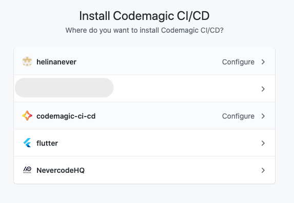

You can sign up to Codemagic using a [GitHub](https://github.com/), [Bitbucket](https://bitbucket.org/) or [GitLab](https://about.gitlab.com/) account or an email address. After signup, you can connect different repository providers and add apps from any self-hosted or cloud-based Git repository, see [Adding repositories](./adding-apps-from-custom-sources).
## GitHub

On signup, you will be asked to authorize Codemagic to authenticate yourself without granting access to any repositories. To have your GitHub repositories available in Codemagic, connect the GitHub App integration.


The GitHub OAuth integration has been deprecated as of April 19, 2021. Codemagic now uses the GitHub App to integrate with GitHub, see the [migration guide](../knowledge-base/migrate-to-github-app/).

### Connecting the GitHub App integration

Codemagic uses the [Codemagic CI/CD GitHub App](https://github.com/apps/codemagic-ci-cd) to integrate with GitHub. To share your GitHub repositories with Codemagic, Codemagic GitHub App will have to be installed on the account or organization in GitHub from which you would like to build applications.


Note that the GitHub App integration can be connected separately for your personal account and each team. The integrations configured for your personal account apply to the apps that are not part of a team in Codemagic. While teams inherit the integrations from team owner's personal account, it is highly recommended to set up repository integrations separately in team settings.


1. In your user or team settings in Codemagic, navigate to the Integrations section and locate the GitHub App integration. The next steps may vary slightly depending on whether you have already authorized Codemagic or have the Codemagic GitHub App installed.
2. Click **Connect** next to the GitHub App integration, and when redirected to GitHub, click **Authorize Codemagic**.
3. Back in the Integrations section, click **Finish installation** and then **Install app**. Note that at this stage you can also revoke your authorization of the app by clicking **Disconnect**.
4. A popup window opens for you to select the organization or account where to install the app. Pick the installation location. You can later install the app to additional accounts.
5. Then choose whether to share **All repositories** from the account or select the repositories to share by choosing **Select repositories only**.
6. Click **Install & Authorize** to finish installation (you may be asked to confirm that action by entering your password). If you do not have the permission to install the app under an organization, you will see the button **Authorize & Request** instead. An approval from the organization owner or app manager is needed to authorize the installation.

### Managing connected GitHub accounts and organizations

In the Integrations section in your user or team settings, click **Manage integration > Configure**. You can then select an account to configure or install Codemagic GitHub App to additional accounts. The accounts that already have Codemagic GitHub App hinstalled are marked with "Configure". 

You can also access the same settings in GitHub by going directly to [https://github.com/apps/codemagic-ci-cd](https://github.com/apps/codemagic-ci-cd) and clicking **Configure**.

These settings allow you to revisit your repository access configuration should you want to share access to additional repositories or revoke access to a previously shared repository. In addition, you can disconnect an account by clicking **Uninstall** in the danger zone.

If you revoke access to previously shared repositories, you will still see all your apps and build history but won't be able to build the apps to which Codemagic no longer has access. Such apps will be grayed out and will show up on the Applications page with the **Removed from repository** filter.

### Disconnecting Codemagic GitHub app integration

The Codemagic CI/CD GitHub App integration can be disabled by clicking **Manage integration > Disconnect** in **User settings > Integrations > GitHub App** for your personal account or in **Team settings > Team Integrations > GitHub App** to disconnect it from the team. This annuls all settings configured for the Codemagic app in GitHub but won't delete your buid history. 

The GitHub app integration is also disabled when you **uninstall** the Codemagic CI/CD app in GitHub. You can still log in to Codemagic with the GitHub App and see your build history if Codemagic CI/CD remains an **authorized GitHub app** in GitHub. 

### Repository is unavailable

Here are some tips on what to check if you can't see your repository listed in Codemagic or it's shown as unavailable.

* If you chose to grant access to **select repositories only** as opposed to all repositories when setting up the GitHub App, make sure you have also granted access to the repository in question. Click **Manage integration > Configure** in team or user integrations to configure repository access settings.
* Your personal Codemagic account and each team have separate integrations. Make sure you have connected the GitHub App integration in the right team or in your user settings.
* If you build apps from different GitHub accounts or organizations, make sure that you have installed the GitHub App on the account that has the repository available. Click **Manage integration > Configure** to see which accounts have been connected. You can also visit [https://github.com/settings/installations](https://github.com/settings/installations) for personal accounts or [https://github.com/organizations/codemagic-ci-cd/settings/installations](https://github.com/organizations/codemagic-ci-cd/settings/installations) for organization accounts to check whether Codemagic CI/CD is listed both under installed and authorized GitHub Apps.
* Private GitHub repositories can be shared with Codemagic only when the GitHub App is installed on the account that owns the repository. If you are a collaborator to a private repository, please ask the repository owner to install Codemagic GitHub App in GitHub: [https://github.com/apps/codemagic-ci-cd](https://github.com/apps/codemagic-ci-cd)

## Sign up via Bitbucket or GitLab

When authenticating using a Bitbucket or GitLab account via OAuth, Codemagic asks for **read/write** permission to access your repositories and create webhooks for automatic building. Write permission is also required for pushing tags to the repository. 

You will need to authorize Codemagic to connect the Bitbucket/GitLab account to your Codemagic account. Once you log in to Codemagic, you will see all your repositories listed.

## Sign up via email

Enter your email address and name and click **Create account** to get started. Codemagic will then send a six-character authentication key on the provided email address. Enter the authentication key and click **Continue** to verify the email address and finish signup. Note that an unused key expires in 10 minutes. 

You will be sent a new authentication key every time you need to log in again.
## Connecting several repository integrations

Private repositories. You can connect several repository accounts (GitHub, GitHub app, GitLab, Bitbucket) with one Codemagic account or Codemagic team (read more about managing team integrations [here](../teams/teams/#managing-team-integrations)).

1. Log in to Codemagic with the account you signed up.
2. Click on your account avatar at the bottom left and open **User settings**.
3. In the **Integrations** section, click **Connect** next to the account you would like to connect to Codemagic.

Once you have connected another account to your Codemagic account, you can log in to Codemagic with either of these accounts. Email notifications with build status reports will be sent to the email address that's connected with the repository from which you build.


Note that if you have connected both GitHub and GitHub App, the GitHub App integration will prevail.
