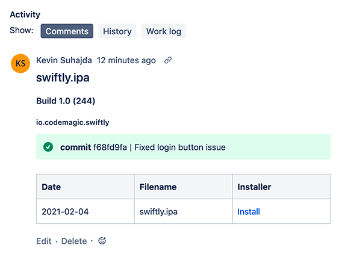

**Jira** is a an issue tracking and project management product developed by Atlassian. Many software development teams use it to maintain visibility of their projects. 

It offers a REST API which can be used used in conjunction with your **Codemagic** workflows in order to add comments, upload attachments or transition the status of an issue, story or epic.

The following example shows how to set up integration with Jira using the **codemagic.yaml** configuration with a **native iOS project** but the approach is the same for **Flutter**, **React Native** and **native Android** projects.

## Getting started

1. Clone the [Jira integratrion starter project](https://github.com/codemagic-ci-cd/jira_integration_demo_project) from the Codemagic GitHub page.

2. You will need access to a Jira account and can [sign up](https://www.atlassian.com/software/jira) for free.

3. Create a [Jira API Token](https://id.atlassian.com/manage-profile/security/api-tokens) once you have access to Jira.

## Add the codemagic.yaml to your project

Copy the **codemagic.yaml** from the starter project into the root of your repository. Update the environment variables as indicated and use the documentation links where required for the values related to building your app, code signing and app publishing. 

## Update the Jira environment variables

There are four **environment variables** that need to be updated for the Jira integration: `JIRA_AUTH`, `JIRA_BASE_URL`, `JIRA_ISSUE` and `JIRA_TRANSITION_ID`


#### Updating the JIRA_AUTH environment variable

The `JIRA_AUTH` environment variable is a base64 encoded string which consists of the email address you log into Jira with and the Jira API token you created: 

`email@example.com:<api_token>`

You can encode these credentials in the **macOS Terminal** using:

```
echo -n 'email@example.com:<api_token>' | openssl base64
```

Alternatively use an online tool to base64 encode this string. 

This value is used in the Authorization header used in cURL requests to the Jira API.

#### Adding the JIRA_BASE_URL environment variable

This is the subdomain you chose when you set up your Jira account e.g. "YOUR_SUBDOMAIN.atlassian.net". Put the subdomain including "atalassian.net" in the `JIRA_BASE_URL` environment variable. 


#### Specifying the  the JIRA_ISSUE environment variable

Issues, epics and stories have a unique id which is usually in the format **'XXXX-N'** and is visible on your issues either in the bottom right or top left when looking at an issue. Put this value in the `JIRA_ISSUE` environment variable. 

#### Finding and updating the JIRA_TRANSITION_ID environment variable

If you want to transition your issue to another status you will need to know what transition ids are available. You can obtain the available transition ids using a cURL request as documented in the [Jira API documentation](https://developer.atlassian.com/cloud/jira/platform/rest/v3/api-group-issues/#api-rest-api-3-issue-issueidorkey-transitions-get). Once you know the transition id then put this value in the `JIRA_TRANSITION_ID` environment variable.

## Adding formatted comments to a Jira issue

Copy the **.templates** folder to the root of your project. This folder contains a template file called **jira.json** which is used to add formatted comments to a Jira issue. 

The Atlassasion Document Format (ADF) is used to format the comment layout and style. Click [here](https://developer.atlassian.com/cloud/jira/platform/apis/document/structure/) for more information about ADF and how to modify this template. 



**Note** that it contains strings beginning with `$` which the scripts use to replace values in the JSON using `sed` before it is added as JSON payload to the `cURL` requests.

## Understanding the 'Post to Jira' script

The script section for publishing to Jira contains several actions which set environment variables, update the comment template and then uses cURL requests to add a comment and upload files to a specific Jira issue.

### Using jq to parse $FCI_ARTIFACT_LINKS

First, it uses **jq** (a command-line tool for parsing JSON) to parse the contents of the Codemagic environment variable `$FCI_ARTIFACT_LINKS` to find information such as the articact url, filename, bundle id and version name and store the values in environment varaibles.

See this link about the JSON data that [$FCI_ARTIFACT_LINKS](../building/environment-variables/#codemagic-read-only-environment-variables) contains.

### Setting additional environment variables

Addtional environment variables are then set such as the build number, build date and commit number. These environment variables are used to replace values in the **jira.json** comment template using **sed** which is a stream editor for parsing and transforming text.

### Making cURL requests to the Jira API 

1. The script performs a request to add a comment to Jira issue specified using the jira.json as the payload.
2. Another request is used to transition the issue to a different status.
3. The script checks to see if XML test results have been generated. See [here](../testing-yaml/testing/) for information about using `test_report` to generate a test report .xml output. If **xml test results** are available then they will be uploaded  to the Jira issue.
4. If **release notes** have been created then these are uploaded to the Jira issue.
