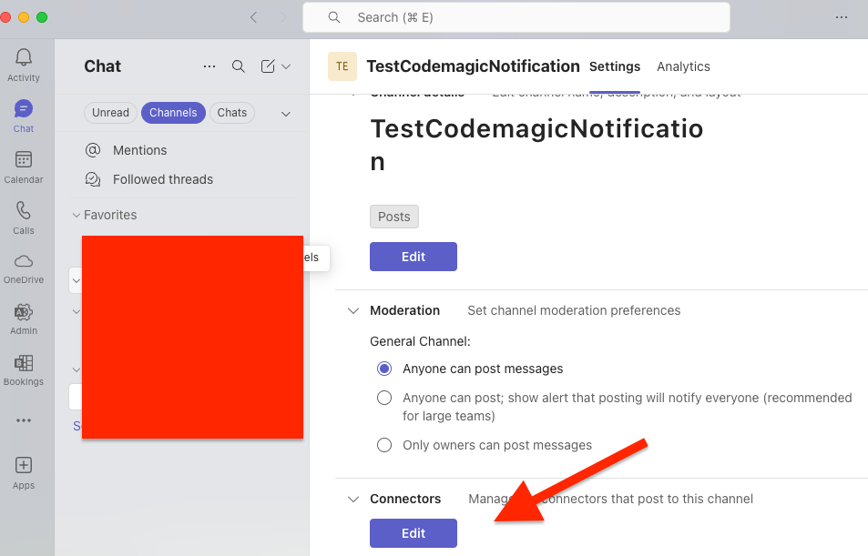
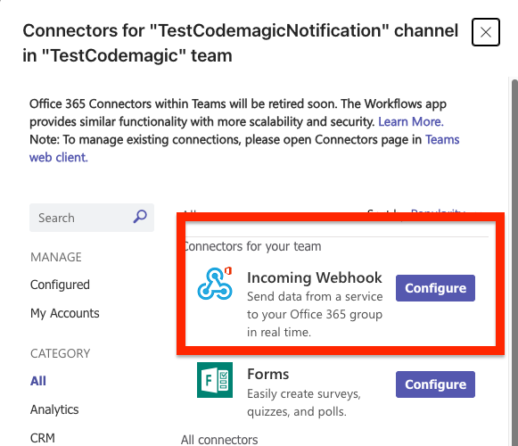

**Microsoft Teams** is a communication and collaboration platform that allows teams to chat, share files, and integrate with external services. If your team uses Microsoft Teams, you can configure Codemagic to send build status notifications directly to a Teams channel using an **Incoming Webhook**.

## Create an Incoming Webhook in Teams

To receive messages in a Teams channel, you first need to configure the **Incoming Webhook**:

1. In Microsoft Teams, open the channel you want to post notifications to.

2. Click **More options** (⋮) → **Connectors** → **Edit**.

3. Add an **Incoming Webhook**.

4. Copy the generated **Webhook URL**.

## Configuring access to Teams in Codemagic

One **environment variable** needs to be added to your workflow for the Teams integration: `TEAMS_WEBHOOK_URL`.

1. Open your Codemagic app settings, and go to the **Environment variables** tab.
2. Enter the desired **_Variable name_**, e.g. `TEAMS_WEBHOOK_URL`.
3. Paste the **Webhook URL** you copied from Teams as the **_Variable value_**.
4. Enter the variable group name, e.g. **_teams_credentials_**. Click the button to create the group.
5. Make sure the **Secret** option is selected.
6. Click the **Add** button to add the variable.

7. Add the variable group to your `codemagic.yaml` file:


  environment:
    groups:
      - teams_credentials


## Post a message to Microsoft Teams

You can send messages to a Teams channel using a simple `curl` request to the webhook.

The following example shows how you can check the publishing status of a build and send a notification to Teams when publishing succeeds:


publishing:
  scripts:
    - name: Send notification to MS Teams
      script: 
        curl -H "Content-Type: application/json" \
          -d '{
                "text": "✅ Test message from Codemagic webhook!"
              }' \
          $TEAMS_WEBHOOK_URL

