In order to allow Codemagic to publish applications to Google Play, it is first necessary to set up the proper Google Play API access. 

## Setting up your Google Play service account for Codemagic

### Setting up the service account on Google Play and Google Cloud Platform

To get started, open up Google Play and navigate to API access under settings and click on 'Create new service account'
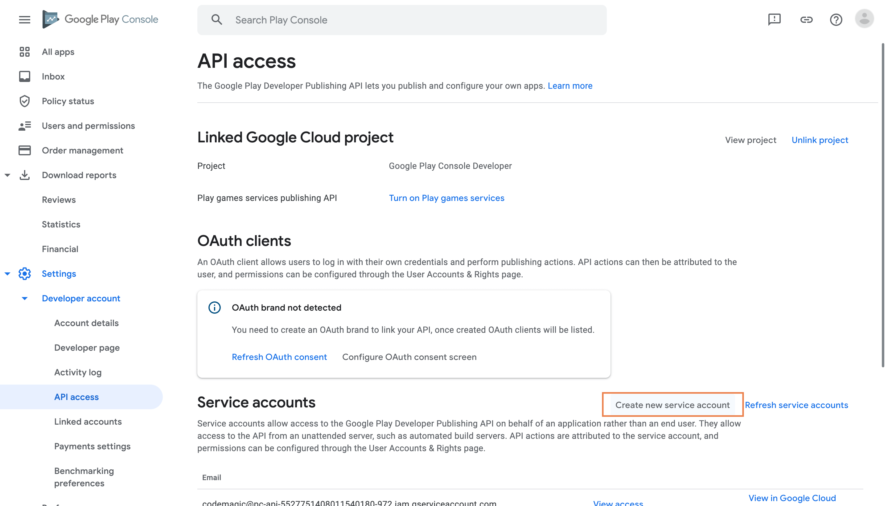

This will lead you to the Google Cloud Platform, where you can get started in creating your service account
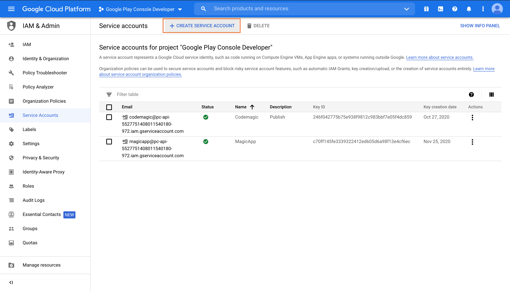

Give the service account 'Editor' access
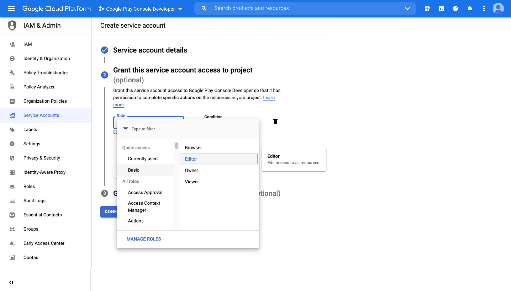

Once the service account has been created, click on 'Create key'

Make sure that the key type is set to JSON and click 'Create'
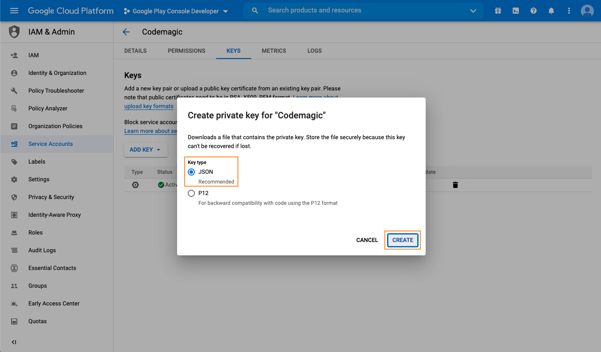

Navigate back to Google Play API access and grant the service account access
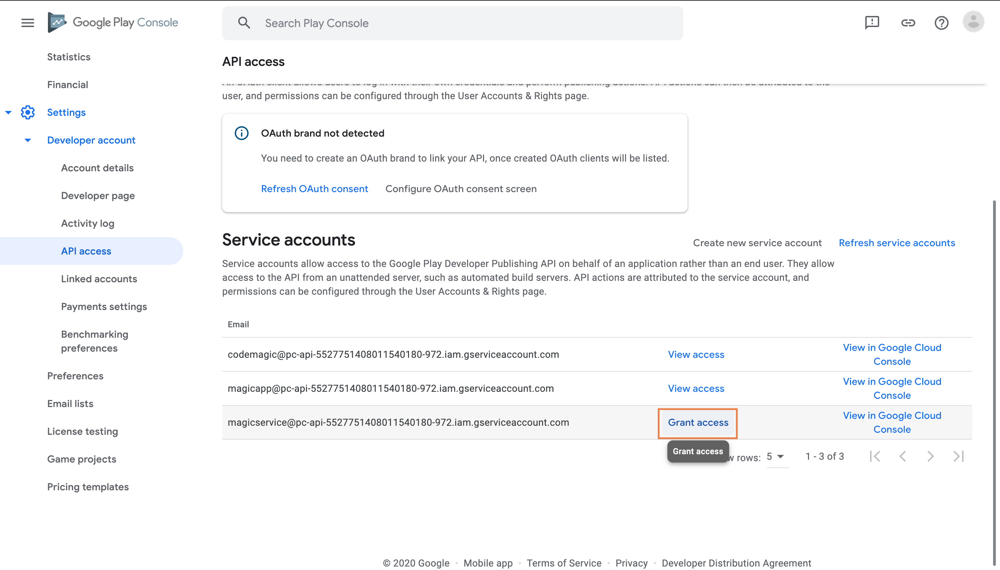

If you wish to grant the service account access to all of your applications, just click 'Invite user'
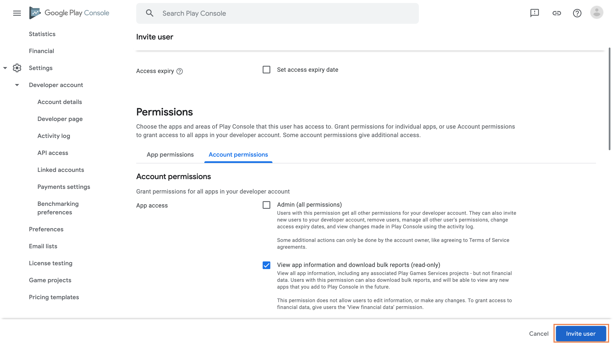

If you wish to grant the service account access to a single app or group of apps, then click on 'App permissions' and add the apps that you wish to grant access for
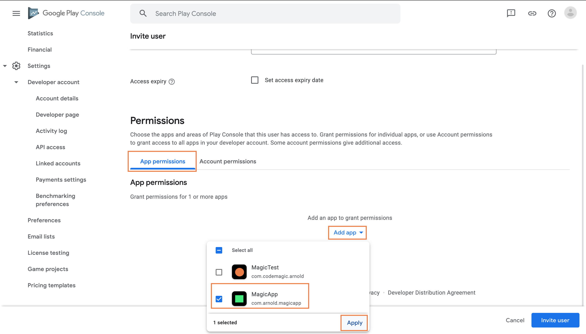

Leave all the default options and click 'Apply'
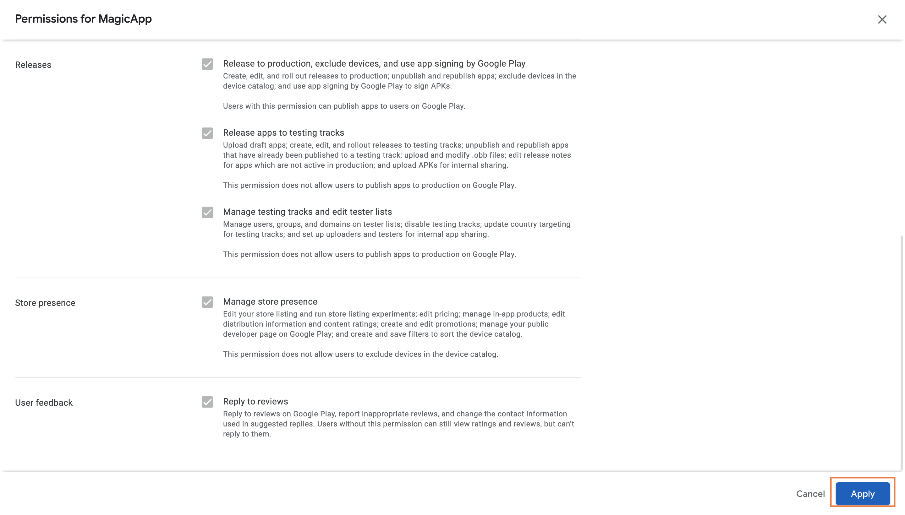

Once that has been done, click 'Invite user' to finish setting up the service account on Google Play
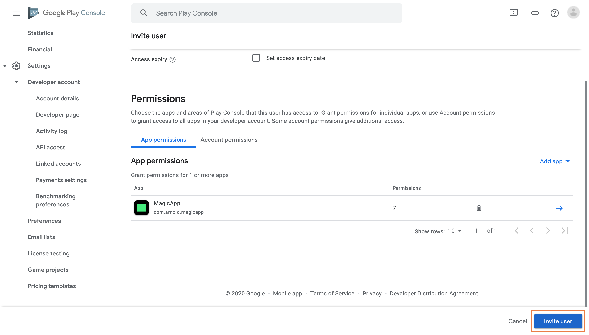

### Using the service account with YAML

Navigate to your app in the Codemagic UI and select 'Encrypt environment variables'
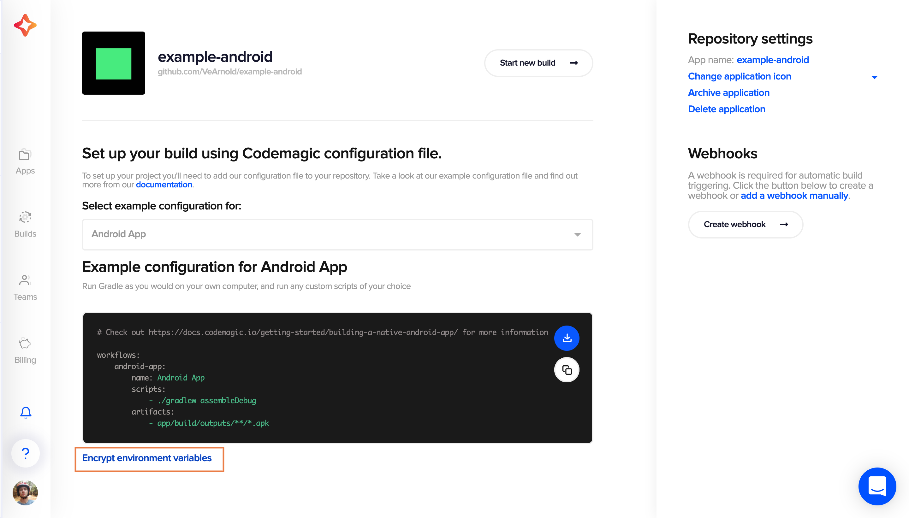

Upload or drop in your JSON key file and copy the encrypted variable
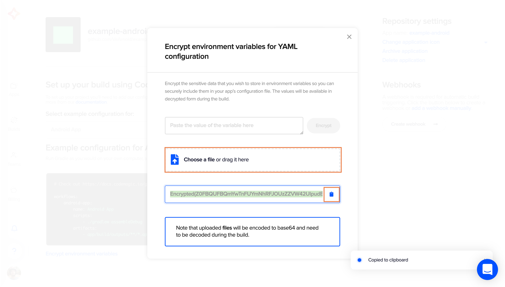

Add the encrypted variable to your YAML under google_play publishing and commit the changes
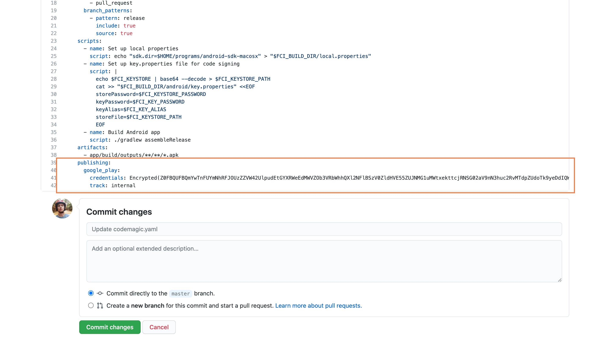

### Using the service account with Flutter UI projects

Navigate to your app in the Codemagic UI and upload your JSON and save changes
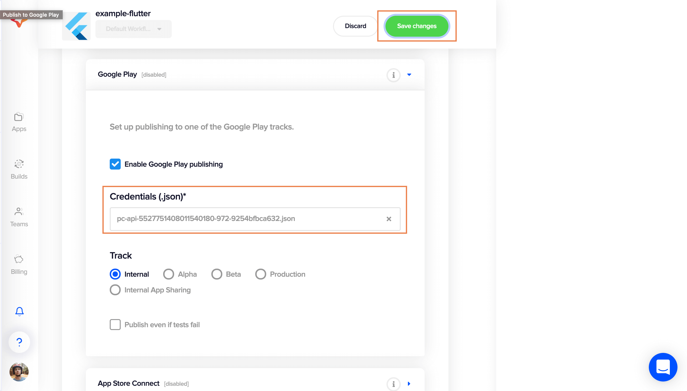
