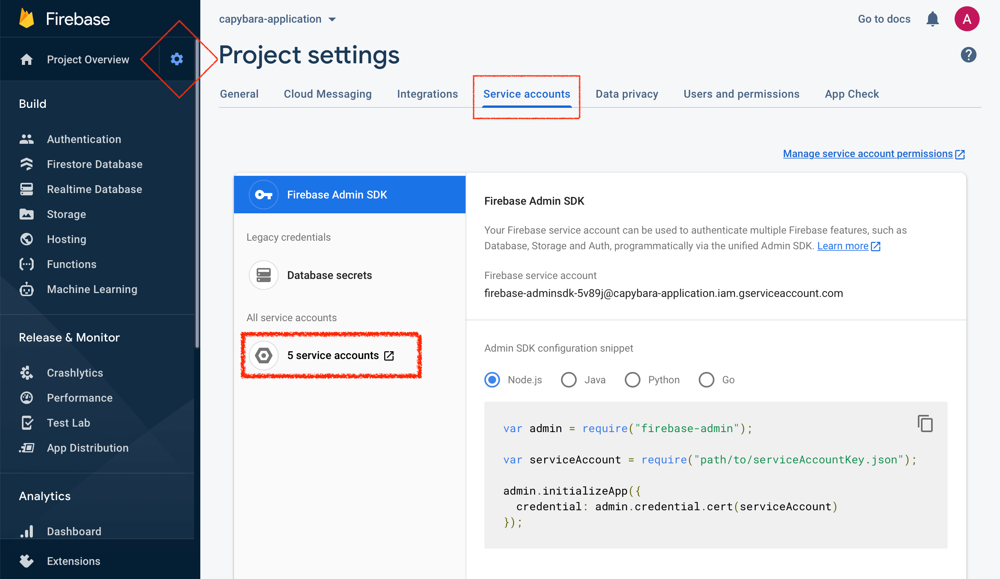
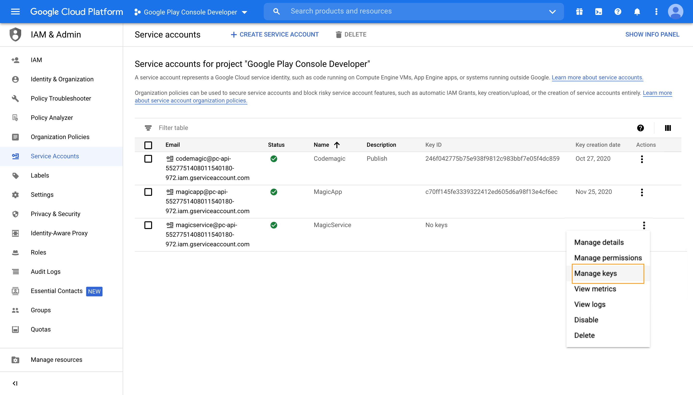
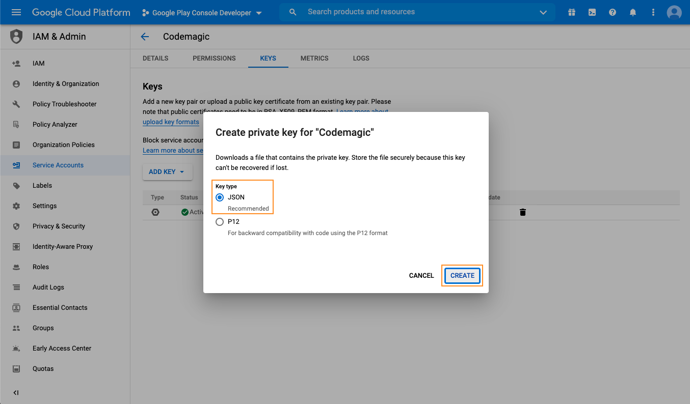

A service account is required when setting up publishing to Google Play or Firebase App Distribution or running tests on Firebase Test Lab. The service account JSON key file must be added to Codemagic to authenticate with these services. This document describes how to create a service account, follow the guides of each integration for details on how to add the JSON key file to Codemagic.
## Google Play

To allow Codemagic to publish applications to Google Play, it is necessary to set up access using Google Play API. 

1. In Google Play Console, navigate to **Settings > API access** and click **Create new service account**.  

2. This will lead you to the Google Cloud Platform. Please follow the steps in [this](/knowledge-base/google-services-authentication/#creating-a-service-account) guide to create a service account with the required role in Google Cloud Platform. Note that **Editor** role is required for Google Play.

3. Back in **Google Play Console**, navigate to **Settings > API access** and click **Grant access** next to the created account.  

4. On the **App permissions** tab, add the applications you wish to grant access to.  

5. Go with the default settings for app permissions and click **Apply** (financial data permissions can be left blank).   

6. On the **Account permissions** tab, leave everything as is (there is no need to grant the service account **Admin** access).  

7. Finally, click **Invite user** to finish setting up the service account on Google Play.

## Firebase

A service account can be used to authenticate with various Firebase services, such as Firebase Test Lab and Firebase App Distribution.

1. On the Firebase project page, navigate to **Project settings** by clicking on the cog button. Select the **Service accounts** tab. Click on the **X service accounts** button as shown on the screenshot.   

2. This will lead you to the Google Cloud Platform. Please follow the steps in [this](/knowledge-base/google-services-authentication/#creating-a-service-account) guide to create a service account with the required role in Google Cloud Platform. Note that **Editor** role is required for Firebase Test Lab and **Firebase App Distribution Admin** for Firebase App Distribution.

## Creating a service account

1. Start creating your service account by clicking **+ Create service account** at the top of the page.  

2. In step 1, fill in the **Service account details** and click **Create**. The name of the service account will allow you to identify it among other service accounts you may have created.

3. In step 2, click the **Select a role** dropdown menu and choose the role. In this example we will use **Editor** as the desired role. Start typing the name of the role that you wish to add.  

4. In step 3, you can leave the fields blank and click **Done**.

5. In the list of created service accounts, identify the account you have just created and click on the menu in the **Actions** column, then click **Manage keys**.  

6. In the Keys section, click **Add Key > Create new key**. Make sure that the key type is set to `JSON` and click **Create**. Save the key file in a secure location to have it available.  

