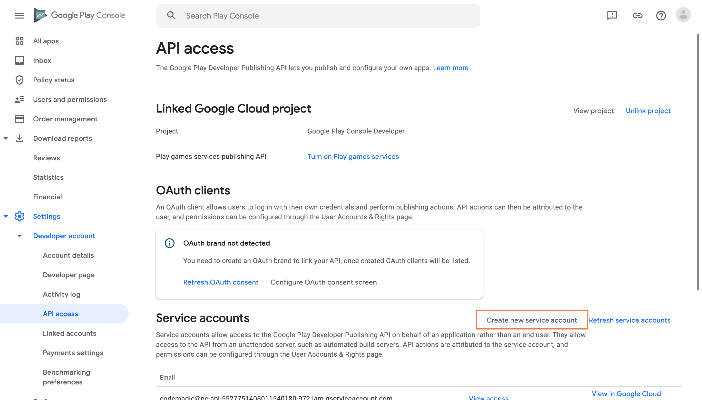
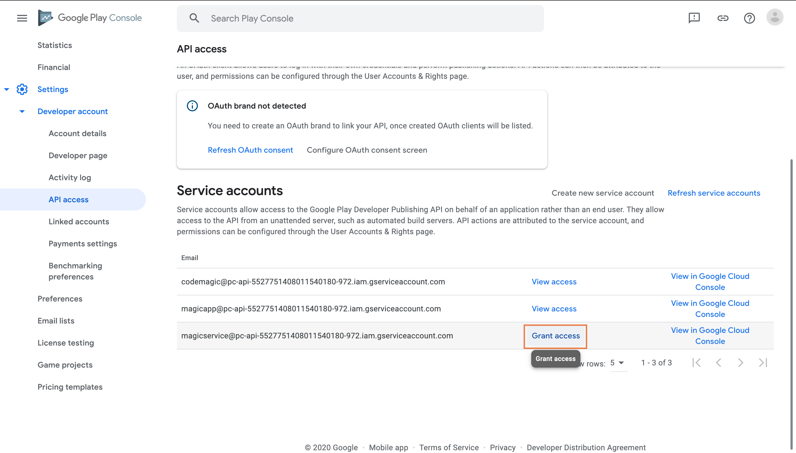
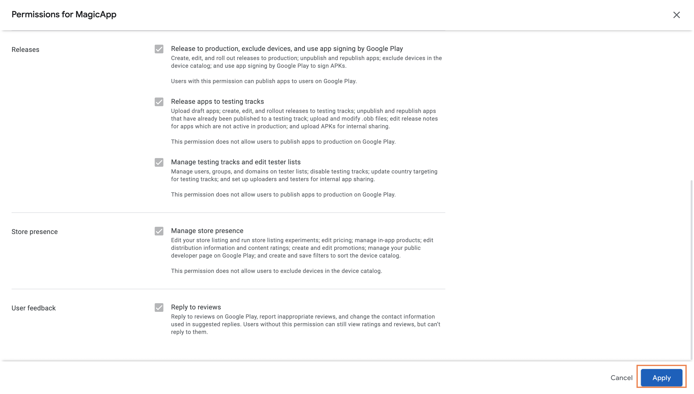
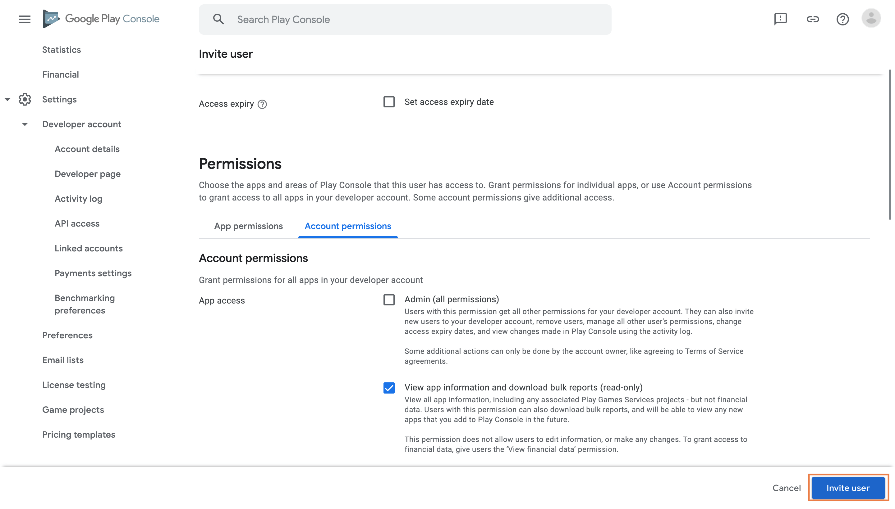

In order to allow Codemagic to publish applications to Google Play, it is necessary to set up access using Google Play API. 

## Setting up the service account on Google Play and Google Cloud Platform

1. In Google Play Console, navigate to **Settings > API access** and click **Create new service account**.<br><br>


2. This will lead you to the Google Cloud Platform. Follow [this](/knowledge-base/google-services-authentication/#creating-a-service-account-with-the-desired-role) guide to create service account with desired role on the Google Cloud Platform side.

3. Navigate back to **Google Play Console > Settings > API access** and click **Grant access** next to the created account.<br><br>


4. On the **App permissions** tab, add the applications you wish to grant access to.<br><br>


5. Go with the default settings for app permissions and click **Apply** (Financial data permissions can be left blank).<br><br> 


6. On the **Account permissions** tab, leave everything as is (there is no need to grant the service account **Admin** access).<br><br>


7. Finally, click **Invite user** to finish setting up the service account on Google Play.

## Using the service account with codemagic.yaml

In order to set up publishing to Google Play, you need to encrypt the contents of the service account `JSON` key file and add the encrypted value to the Codemagic configuration file.

1. Navigate to your app settings in the Codemagic UI and click **Encrypt environment variables** at the bottom of the screen.<br><br>


2. Open your `JSON` key file in an IDE of your choice and copy the contents, then proceed to paste the contents of your `JSON` key file to the encryption interface and copy the encrypted value.

3. In your configuration file, set the encrypted value to the `credentials` variable under `google_play` publishing and commit the changes.
```yaml
workflows:
    publish-workflow:
        name: Publish to Google Play
        ...
        publishing:
            google_play:
                credentials: Encrypted(...)
                track: alpha # specify the Google Play destination track
```


## Using the service account with projects configured with the Flutter workflow editor

When configuring Flutter projects through the workflow editor, the service account `JSON` key file must be uploaded to Codemagic in Google Play publishing settings. Follow the instructions [here](../publishing/publishing-to-google-play).

## Creating a service account with the desired role

1. Start creating your service account by clicking **+ Create service account** at the top of the page.<br><br>


2. In step 1, fill in the **Service account details** and click **Create**. The service account's name will allow you to identify it among other service accounts you may have created.

3. In step 2, click the **Select a role** dropdown menu and choose **Basic > Editor** as the role.<br><br>


4. In step 3, you can leave the fields blank and click **Done**.

5. In the list of created service accounts, identify the account you have just created and click on the menu in the **Actions** column, then click **Manage keys**.<br><br>


6. In the Keys section, click **Add Key > Create new key**. Make sure that the key type is set to `JSON` and click **Create**. Save the key file in a secure location to have it available.<br><br>


