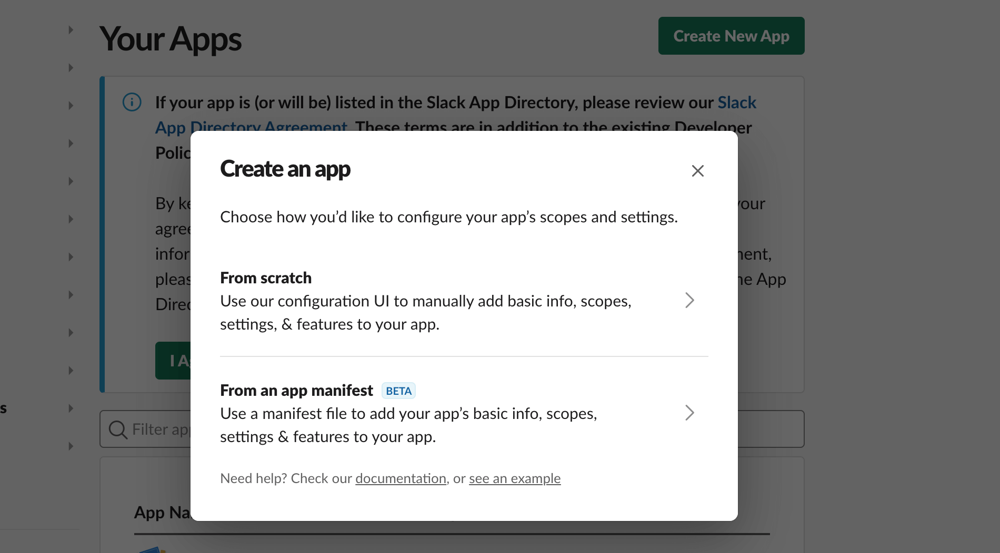
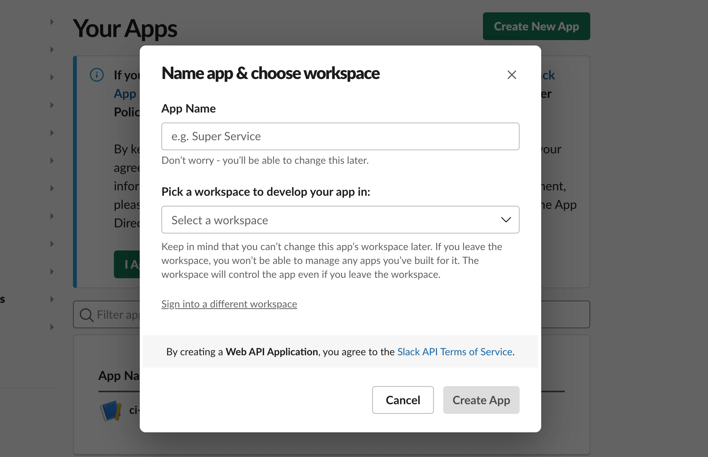
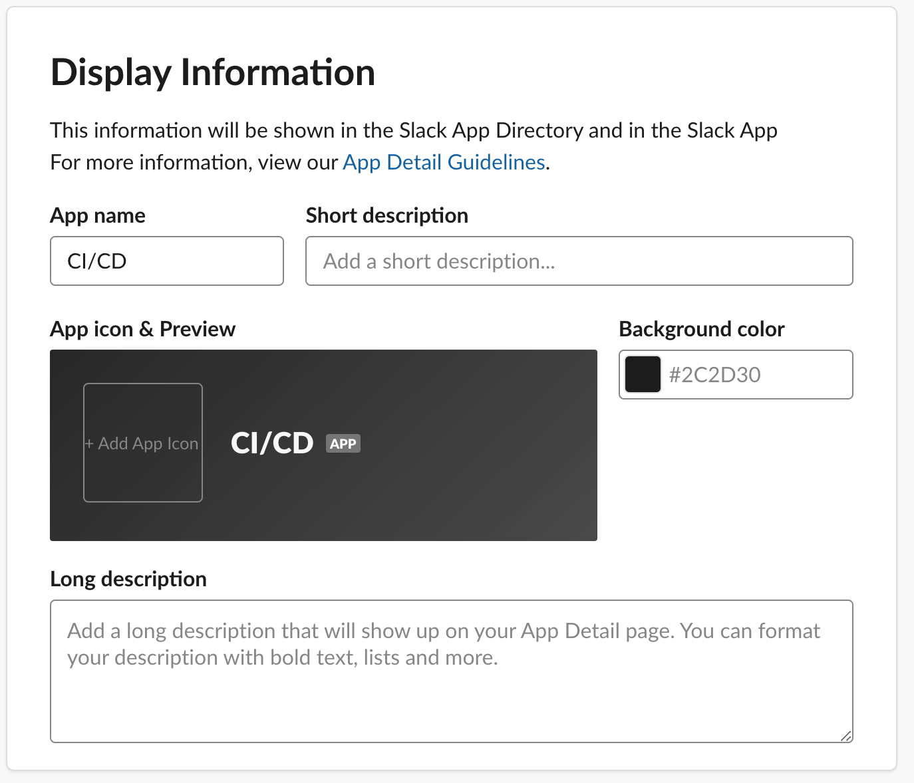
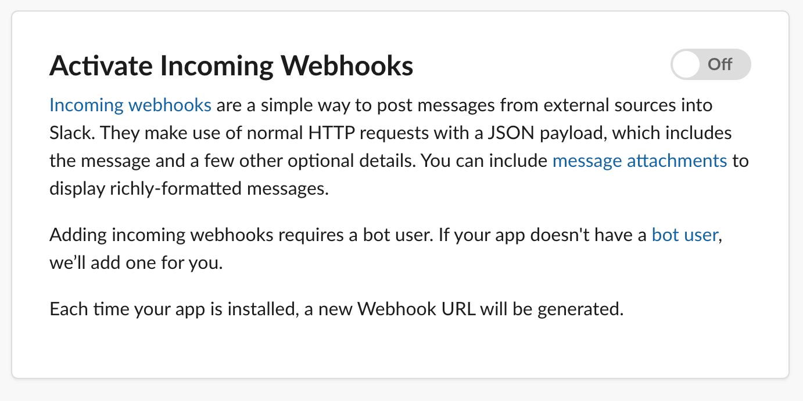
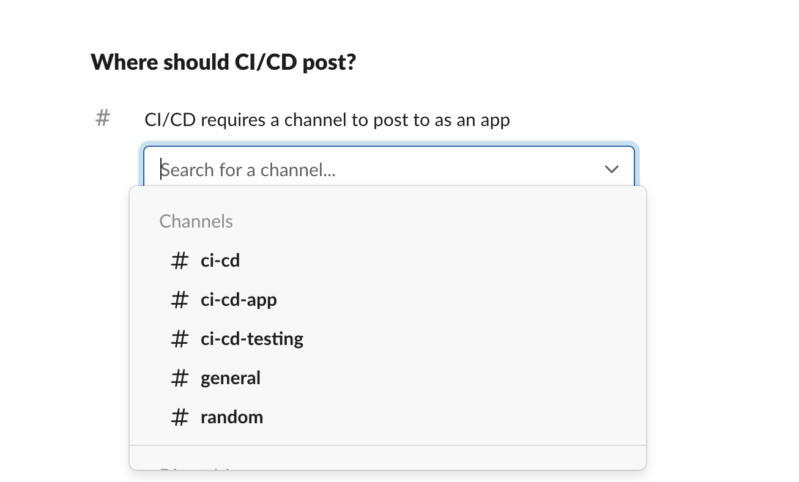

Customize Slack notifications for publishing into your Codemagic build pipeline by building a slack app from scratch via webhooks.

### Step 1: Create a new Slack App

To create a new Slack App, go to Slack App settings page [here](https://api.slack.com/apps). **Create new App > From scratch**

Give it a name for e.g. **Codemagic CI/CD** and select the workspace of your choice to install the app.
Click create App.

Go to you **App settings > Basic Information > Display Information** and fill all the general details.

### Step 2: Add a new webhook to the slack app.

You will see that the newly created app is added and visible under App settings page [here](https://api.slack.com/apps). Select the App, it will take you to a dedicated app settings page. **Activate** the Incoming webhook request.

Navigate to **Incoming Webhooks > Add new webhook to the workspace**. This will generate the webhook url. Copy the webhook url and add it as an ENV variable e.g. SLACK_WEBHOOK_URL.

### Step 3: Setting required variables.

Codemagic exports several built-in environment variables during the build that you can use in scripts to customize the build process. You can refer to the documentation [here](../variables/environment-variables/)

For our example, we will be passing the below variables for our custom slack integration.

1. $CM_BUILD_ID - UUID of the build
2. $CM_BRANCH - The current branch being built, for pull requests it is the source branch
3. $CM_REPO_SLUG - The slug of the repository that is currently being built in the form `owner_name/repository_name`. Unset for repositories added from custom source
4. $CM_COMMIT - Commit hash that is currently being built by Codemagic, for pull request builds it is the hash of the source commit.
5. $ARTIFACT_URL - Android Artifact Link
6. $CM_PROJECT_ID - UUID of the project that is being built


ARTIFACT_URL=$(echo $CM_ARTIFACT_LINKS | jq -r '.[] | select(.name | endswith("'".apk"'")) | .url')


### Step 4: Create the JSON Payload

Navigate to Slack Block Kit builder [here](https://app.slack.com/block-kit-builder) to create a template or you can use the below reference template. You need to substitute the variables in the JSON Payload as shown below.


{
  "attachments": [
    {
      "blocks": [
        {
          "type": "section",
          "text": {
            "type": "mrkdwn",
            "text": "Build with build id <https://codemagic.io/app/$CM_PROJECT_ID/build/$CM_BUILD_ID|$CM_BUILD_ID>
          }
        },
        {
          "type": "divider"
        },
        {
          "type": "section",
          "block_id": "section567",
          "text": {
            "type": "mrkdwn",
            "text": "<https://github.com/himesh-cm/$CM_REPO_SLUG> Merge pull request"
          }
        },
        {
          "type": "divider"
        },
        {
          "type": "section",
          "text": {
            "type": "mrkdwn",
            "text": "*Android Artifact Link* <$ARTIFACT_URL|Download>"
          }
        },
      ]
    }
  ]
}


### Step 5: Making the cURL Request

You can specify the JSON Payload in your post processing script, if you are using the workflow editor or add it as script step in your workflow if you are using yaml.


curl -X POST -H 'Content-type: application/json' --data '{"text":"payload"}' $SLACK_WEBHOOK_URL


payload refers to the the JSON Payload, which you can save as a variable
