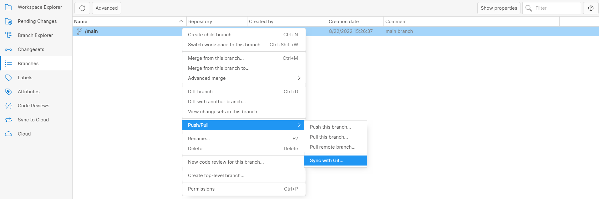

[Plastic SCM](https://www.plasticscm.com/) is a full-featured DVCS (Distributed Version Control Software)which also supports the Git network protocol.
Plastic SCM can push and pull changes directly to any remote Git server. This is because Plastic supports the `https://` and `git://` protocols for pushing and pulling changesets.

This feature immediately turns Plastic SCM into a DVCS fully compatible with Git. The advantage of this is that you can use Plastic or Git on your workstation and still participate in Git projects (GitHub, CodePlex, and many more). Check out the official [GitSync documentation](https://www.plasticscm.com/documentation/gitsync/plastic-scm-version-control-gitsync-guide).

To do so, you can right click on any branch in the `Branches` tab and **Sync with Git**.

Then you need to add your `Git repository URL`, `User Name`, and `Password` to access that repository.
