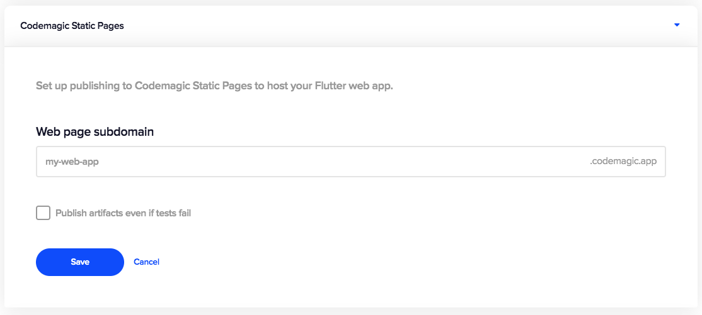

---
categories:
  - Publishing
description: Publish each new version of your web app to a custom subdomain.
title: Publishing to Codemagic Static Pages
weight: 3
---

You can publish your web app to a custom subdomain of `codemagic.app` for easy access.

1. Go to **App settings > Publish > Codemagic Static Pages** to configure publishing to Codemagic Static Pages.  
   
2. Choose a subdomain name and enter it in the **Web page subdomain** field. By default, we suggest your app name as the subdomain name.
3. Check **Publish artifacts even if tests fail** to publish the build even when one or more tests fail. Leaving this option unchecked will publish only successful builds that pass the tests, if any.
4. Click **Save** to finish the setup. On saving, we'll check the availability of the subdomain name and inform you if the name is already taken.

Now each time you run a build of your web app on Codemagic, you’ll see the web app artifact being published to the web page in Codemagic logs and can immediately access the app at the specified URL.
