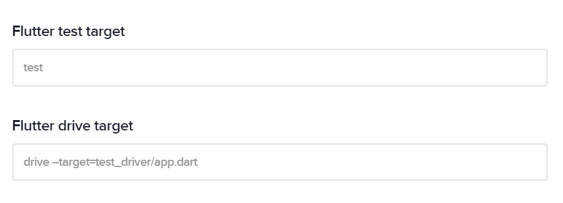
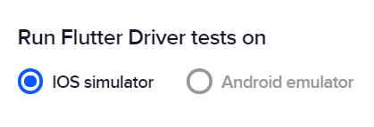

---
description:
  Automatically run unit, widget and integration tests every time you build
  your Flutter app.
title: Running automated tests
weight: 1
---

Codemagic supports running **unit**, **integration** and **widget** tests. When testing is enabled, tests are run automatically every time your project is built. You can configure the test settings in **App settings > Test**.

### Detecting tests

During the first build of your app, Codemagic will scan the content of the repository and automatically detect the tests according to the project structure. The expected locations of the tests are as follows:

Unit and widget tests: `project_root/test`

Integration tests (Flutter Driver tests): `project_root/test_driver`

{}

If your Flutter project is in a subdirectory of the repository, Codemagic cannot detect your tests automatically unless you add at least one test file in the `project_root/test` or `project_root/test_driver` folder.

{}

### Specifying the test target

In App settings > Test, you will see the **Flutter test target** and **Flutter drive target** fields displayed if the respective tests are detected. You can specify an exact target to run a specific test.

### Selecting simulator or emulator

By default, Codemagic runs your Flutter Driver tests on iOS simulator. You can also run Flutter Driver tests on Android emulator by selecting the respective option in the UI.

{}

**Tip**: You can set up separate [workflows](https://4jqkxhrybmvg1a.preview.forestry.io/docs/getting-started/creating-workflows/ 'Creating workflows') to run tests both on iOS and Android.

{}

### Enabling or disabling tests

You can enable or disable running tests by checking or unchecking the respective option in App settings > Test:

- Enable Flutter test
- Enable Flutter Driver

### Stop build if tests fail

At the bottom of the Test section, you can select the **Stop build if tests fail** option to stop the build immediately when any of the tests fail. As the tests are run before building the iOS or Android app, you can get the result of the build faster. Builds stopped when tests fail will be shown as "failed".
