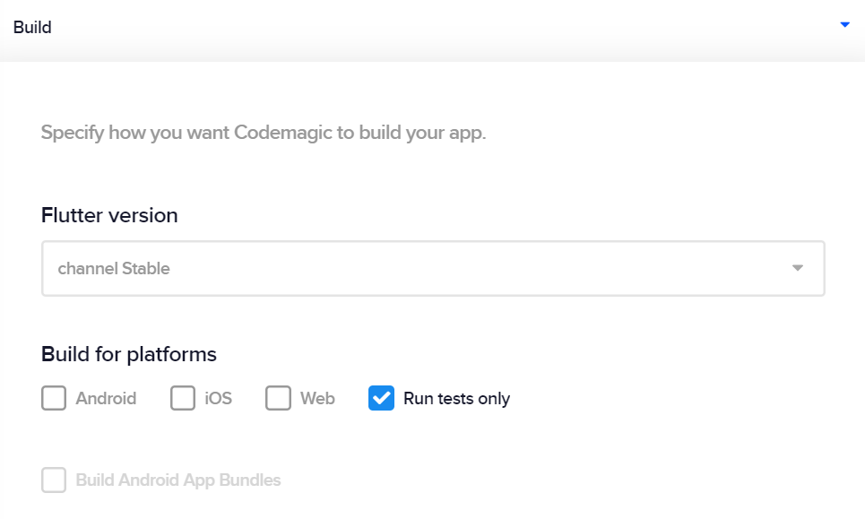

---
categories:
  - Testing
description: Run tests only without building the app.
title: Running tests only
weight: 4
---

You can have a workflow to run tests without building the app. In App settings > Build > Build for platforms, select **Run tests only**. Codemagic will then build the workflow until the testing step and skip building for Android or iOS.

If tests fail, the status of the build will be "failed" and you'll receive an email about failing tests. If you have publishing to Slack configured, you'll receive notifications on build status updates.
