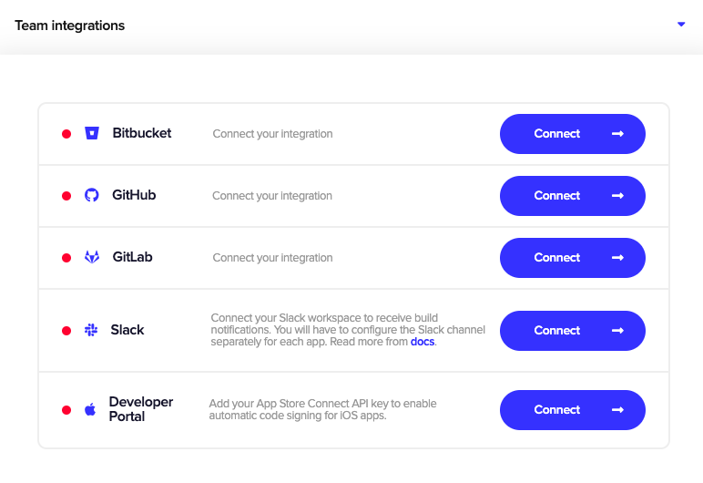

Integrate Slack publishing into your Codemagic build pipeline to get notified when a build starts and receive build artifacts or logs when the build finishes.

### Connecting your Slack workspace

To set up publishing to Slack, you first need to connect your Slack workspace in **Teams > Personal Team > Integrations > Slack** for personal apps and in **Teams > Your Team Name > Team integrations > Slack** for team apps.

Click **Connect** next to the Slack integration. You will then be redirected to an authorization page. Review the requested permissions and click **Allow** to give Codemagic Slack app access to your Slack workspace and allow it to post build status updates and build artifacts (see also our [privacy policy](https://codemagic.io/privacy-policy/)).

After you have successfully authorized Codemagic and connected your workspace, you will be redirected back to Codemagic. You can disconnect your Slack workspace anytime by clicking **Disconnect**.

### Configuring Slack publishing

The Slack channel for publishing is configured separately for each workflow in the `publishing` section of `codemagic.yaml` (refer [here](../publishing/email-and-slack-notifications/#slack) if you're configuring app settings in the Flutter workflow editor).


**Note:** In order to publish to **private channels**, you need to invite the Codemagic app to the channels; otherwise, the app does not have access to private channels. To invite Codemagic app to private channels, write `@codemagic` in the channel. If the private channel access is restricted by Slack admin rights, it will have to be changed manually, otherwise publishing to that channel will not be possible.


If the build finishes successfully, release notes (if passed), and the generated artifacts will be published to the specified channel. If the build fails, a link to the build logs is published. When you set `notify_on_build_start` to `true`, the channel will be notified when a build starts.

If you don't want to receive a Slack notification on build success or failure, you can set `success` to `false` or `failure` to `false` accordingly.



publishing:
  slack:
    channel: '#channel-name'
    notify_on_build_start: true # To receive a notification when a build starts
    notify:
      success: false # To not receive a notification when a build succeeds
      failure: false # To not receive a notification when a build fails


When you set up Slack publishing, Codemagic publishes the following artifacts:

- `app`
- `ipa`
- `apk`
- the archive with Flutter web build directory
- Linux application bundle files, Windows MSIX packages
