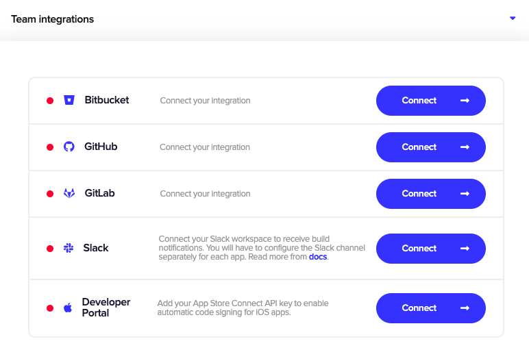
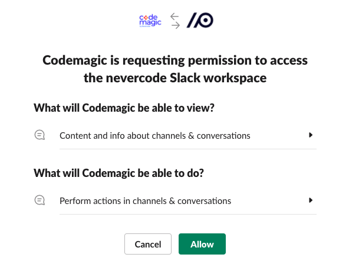
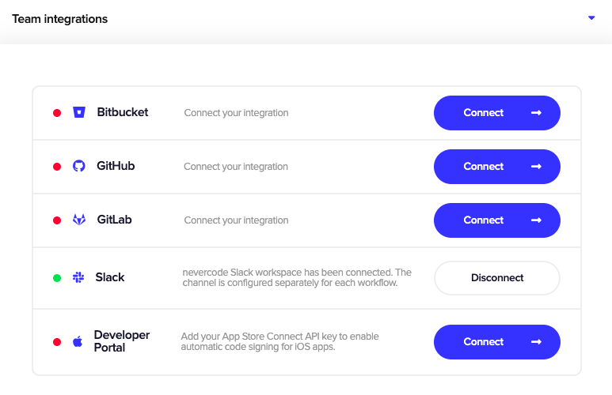

All generated artifacts can be published to external services. The available integrations currently are email, Slack, Google Play, and App Store Connect. It is also possible to publish elsewhere with custom scripts; see the examples below.

## Integrations for publishing and notifications

Codemagic has out-of-the-box support for publishing to the services listed below. Read more about each integration and see the configuration examples below.

### Email

If the build finishes successfully, release notes (if passed), and the generated artifacts will be published to the provided email address(es). If the build fails, an email with a link to build logs will be sent.

If you don't want to receive an email notification on build success or failure, you can set `success` to `false` or `failure` to `false` accordingly.

```yaml
publishing:
  email:
    recipients:
      - name@example.com
    notify:
      success: false     # To not receive a notification when a build succeeds
      failure: false     # To not receive a notification when a build fails
```

### Slack

Integrate Slack publishing into your Codemagic build pipeline to get notified when a build starts and receive build artifacts or logs when the build finishes.

#### Connecting your Slack workspace

To set up publishing to Slack, you first need to connect your Slack workspace in **User settings > Integrations > Slack** for personal apps and in **Teams > Your_team > Team integrations > Slack** for team apps. 



Click **Connect** next to the Slack integration. You will then be redirected to an authorization page. Review the requested permissions and click **Allow** to give Codemagic Slack app access to your Slack workspace and allow it to post build status updates and build artifacts (see also our [privacy policy](https://codemagic.io/privacy-policy/)).



After you have successfully authorized Codemagic and connected your workspace, you will be redirected back to Codemagic. You can disconnect your Slack workspace anytime by clicking **Disconnect**.



#### Configuring Slack publishing

The Slack channel for publishing is configured separately for each workflow in the `publishing` section of `codemagic.yaml` (refer [here](../publishing/email-and-slack-notifications/#slack) if you're configuring app settings in the Flutter workflow editor).


In order to publish to **private channels**, you need to invite the Codemagic app to the channels; otherwise, the app does not have access to private channels. To invite Codemagic app to private channels, write `@codemagic` in the channel. If the private channel access is restricted by Slack admin rights, it will have to be changed manually, otherwise publishing to that channel will not be possible.


If the build finishes successfully, release notes (if passed), and the generated artifacts will be published to the specified channel. If the build fails, a link to the build logs is published. When you set `notify_on_build_start` to `true`, the channel will be notified when a build starts.

If you don't want to receive a Slack notification on build success or failure, you can set `success` to `false` or `failure` to `false` accordingly.

```yaml
publishing:
  slack:
    channel: '#channel-name'
    notify_on_build_start: true    # To receive a notification when a build starts
    notify:
      success: false               # To not receive a notification when a build succeeds
      failure: false               # To not receive a notification when a build fails
```

### Google Play

Codemagic enables you to automatically publish your app either to one of the predefined tracks (`internal`- publish for internal testing and QA, `alpha`- publish for testing with a small group of trusted users, `beta`- publish for testing to a wider set of users and `production`- release the app to production) on Google Play or to your custom closed testing tracks. In order to do so, you will need to set up a service account in Google Play Console and add the `JSON` key file to your Codemagic configuration file; see how to [set up a service account](../knowledge-base/google-play-api/). The proper way to add your keys to `codemagic.yaml` is to [encrypt](../building/encrypting) the key file contents and add the encrypted value into the configuration file.

If your application supports [in-app updates](https://developer.android.com/guide/playcore/in-app-updates), Codemagic allows setting the update priority. Otherwise, `in_app_update_priority` can be omitted or set to `0`.

In addition, Codemagic supports [staged releases](https://support.google.com/googleplay/android-developer/answer/6346149?hl=en), allowing users to choose which fraction of the testers or users get access to the application. To release to everyone, omit `rollout_fraction` from codemagic.yaml. 

```yaml
publishing:
  google_play:                        # For Android app
    credentials: Encrypted(...)       # JSON key file for Google Play service account
    track: alpha                      # Name of the track: internal, alpha, beta, production, internal app sharing, or your custom track name
    in_app_update_priority: 3         # Priority of the release (only set if in-app updates are supported): integer in range [0, 5]
    rollout_fraction: 0.25            # Rollout fraction (set only if releasing to a fraction of users): value between (0, 1)
    changes_not_sent_for_review: true # To be used ONLY if your app cannot be sent for review automatically *
```


\* The field `changes_not_sent_for_review` is required if you are getting the next error:

`Changes cannot be sent for review automatically. Please set the query parameter changesNotSentForReview to true. Once committed, the changes in this edit can be sent for review from the Google Play Console UI.`

If your changes are sent to review automatically, but the field is still set to `true`, you will get the next error:

`Changes are sent for review automatically. The query parameter changesNotSentForReview must not be set.`


If you are getting a 400 error related to the app being in draft status, you need to promote your draft build to the next level up of testing tracks. Play Console will show you how to do this. You'll need to go through the steps, fill out questionnaires, upload various screenshots, and then after approval, you can move to the Alpha testing track, and Codemagic will successfully publish (publishing builds on Draft status is not supported).

If you are getting an error related to permissions, then it is likely an issue related to the service account that has been created. Go through the steps of creating a service account once more carefully see how to [set up a service account](../knowledge-base/google-play-api/).


You can override the publishing track specified in the configuration file using the environment variable `GOOGLE_PLAY_TRACK`. This is useful if you're starting your builds via [Codemagic API](../rest-api/overview/) and want to build different configurations without editing the configuration file.


### App Store Connect

Codemagic enables you to automatically publish your iOS or macOS app to [App Store Connect](https://appstoreconnect.apple.com/) for beta testing with [TestFlight](https://developer.apple.com/testflight/) or distributing the app to users via App Store. Codemagic uses the **App Store Connect API key** for authenticating communication with Apple's services. You can read more about generating an API key from Apple's [documentation page](https://developer.apple.com/documentation/appstoreconnectapi/creating_api_keys_for_app_store_connect_api). 

Please note that
1. for App Store Connect publishing, the provided key needs to have [App Manager permission](https://help.apple.com/app-store-connect/#/deve5f9a89d7),
2. and in order to submit your iOS application to App Store Connect, it must be code signed with a distribution [certificate](https://developer.apple.com/support/certificates/).  

```yaml
publishing:
  app_store_connect:                  # For iOS or macOS app
    api_key: Encrypted(...)           # Contents of the API key, can also reference environment variable such as $APP_STORE_CONNECT_PRIVATE_KEY
    key_id: 3MD9688D9K                # Alphanumeric value that identifies the API key, can also reference environment variable such as $APP_STORE_CONNECT_KEY_IDENTIFIER
    issuer_id: 21d78e2f-b8ad-...      # Alphanumeric value that identifies who created the API key, can also reference environment variable such as $APP_STORE_CONNECT_ISSUER_ID
    submit_to_testflight: true        # Optional boolean, defaults to false. Whether or not to submit the uploaded build to TestFlight beta review. Required for distributing to beta groups. Note: This action is performed during post-processing.
    beta_groups:                      # Specify the names of beta tester groups that will get access to the build once it has passed beta review. 
          - group name 1
          - group name 2

```

### Post-processing of App Store Connect distribution

Some App Store Connect actions, like `submit_to_testflight`, `beta_groups` and uploading release notes take place asynchronously in the post-processing step after the app artifact has been successfully published to App Store Connect and the main workflow has completed running in Codemagic. This avoids using the macOS build machine while we are waiting for Apple to complete processing the build and it becomes available for further actions. 

Post-processing has a two-step timeout. If the uploaded build cannot be found in App Store Connect in 15 minutes, the step times out. This may happen if there are issues with the uploaded artifact, in which case the build does not become available in App Store Connect at all and you'll receive an email from App Store Connect. The overall timeout for post-processing is 120 minutes. If the uploaded build has not exited the processing status by then, post-processing in cancelled. You will be still able to manually submit the build to beta review, upload release notes and distribute the app to beta groups once the build becomes available in App Store Connect.

Note that Codemagic does not send status updates on the post-processing step. You can check the build log for the status of post-processing or check your email for updates from App Store Connect.

Post-processing does not consume any build minutes.

## GitHub releases

Publishing GitHub releases is available for GitHub repositories only.


As of deprecating the GitHub OAuth integration, Codemagic no longer has write access to the repositories. Setting up a personal access token is needed to publish releases to GitHub. Please follow the instructions below.


Publishing happens only for successful builds triggered on tag creation and is unavailable for manual builds.

1. Create a personal access token in GitHub as described [here](https://docs.github.com/en/github/authenticating-to-github/creating-a-personal-access-token).
2. Add the personal access token as an environment variable with the name `GITHUB_TOKEN` in the `environment` section.
3. In the `triggering` section, configure triggering on tag creation. Don't forget to add a branch pattern and ensure the webhook exists.

  ```yaml
  triggering:
    events:
      - tag
  ```

4. Add the following script after the build or publishing scripts that publish the artifacts with tag builds. Edit the placeholders like your application name and the path to build artifacts to match your setup.

    ```bash
    #!/usr/bin/env zsh

    # Publish only for tag builds
    if [ -z ${FCI_TAG} ]; then
    echo "Not a tag build will not publish GitHub release"
    exit 0
    fi

    # See more options about `gh release create` usage from GitHub CLI
    # official docs at https://cli.github.com/manual/gh_release_create

    gh release create "${FCI_TAG}" \
        --title "<Your Application Name> ${FCI_TAG}" \
        --notes-file changelog.md \
        path/to/build-artifact.ipa \
        path/to/build-artifact.apk

    # Note that you don't need to include title and changelog if you do not want to.
    # Any number of artifacts can be included with the release.
    ```

## Publishing a Flutter package to pub.dev

In order to get publishing permissions, first, you will need to log in to pub.dev locally. It can be done by running `pub publish --dry-run`.
After that, `credentials.json` will be generated, which you can use to log in without the need for Google confirmation through the browser.

`credentials.json` can be found in the pub cache directory (`~/.pub-cache/credentials.json` on MacOS and Linux, `%APPDATA%\Pub\Cache\credentials.json` on Windows)

```yaml
- echo $CREDENTIALS | base64 --decode > "$FLUTTER_ROOT/.pub-cache/credentials.json"
- flutter pub publish --dry-run
- flutter pub publish -f
```

## Publishing an app to Firebase App Distribution

If you use a Firebase service, encrypt `google-services.json` as `ANDROID_FIREBASE_SECRET` environment variable for Android
or `GoogleService-Info.plist` as `IOS_FIREBASE_SECRET` for iOS.

```bash
echo $ANDROID_FIREBASE_SECRET | base64 --decode > $FCI_BUILD_DIR/android/app/google-services.json
echo $IOS_FIREBASE_SECRET | base64 --decode > $FCI_BUILD_DIR/ios/Runner/GoogleService-Info.plist
```

### Publishing an app to Firebase App Distribution

Codemagic enables you to automatically publish your iOS or Android app to [Firebase Console](https://console.firebase.google.com/). Codemagic uses your **Firebase token** for authentication with Firebase App Distribution. To retrieve the token, follow the instructions in [Firebase documentation](https://firebase.google.com/docs/cli#cli-ci-systems). For distributing an iOS application to Firebase App Distribution, your application must use a development, Ad Hoc or Enterprise distribution profile.

Make sure to [encrypt](https://docs.codemagic.io/building/encrypting/) your Firebase token. It is possible to add the encrypted token directly under publishing or save it to the `FIREBASE_TOKEN` environment variable and reference it under publishing.

Android

```yaml
publishing:
  firebase:
    firebase_token: Encrypted(...) # Add your encrypted Firebase token, or add it to your environment variables and reference as $FIREBASE_TOKEN
    android:
      app_id: x:xxxxxxxxxxxx:android:xxxxxxxxxxxxxxxxxxxxxx # Add your Android app id retrieved from Firebase console
      groups: # Add one or more groups that you wish to distribute your Android application to, you can create groups in the Firebase console
        - androidTesters
        - ...
```

iOS

```yaml
publishing:
  firebase:
    firebase_token: Encrypted(...) # Add your encrypted Firebase token, or add it to your environment variables and reference as $FIREBASE_TOKEN
    ios:
      app_id: x:xxxxxxxxxxxx:ios:xxxxxxxxxxxxxxxxxxxxxx # Add your iOS app id retrieved from Firebase console
      groups: # Add one or more groups that you wish to distribute your iOS application to, you can create groups in the Firebase console
        - iosTesters
        - ...
```

Android and iOS

```yaml
publishing:
  firebase:
    firebase_token: Encrypted(...) # Add your encrypted Firebase token, or add it to your environment variables and reference as $FIREBASE_TOKEN
    android:
      app_id: x:xxxxxxxxxxxx:android:xxxxxxxxxxxxxxxxxxxxxx # Add your Android app id retrieved from Firebase console
      groups: # Add one or more groups that you wish to distribute your Android application to, you can create groups in the Firebase console
        - androidTesters
        - ...
    ios:
      app_id: x:xxxxxxxxxxxx:ios:xxxxxxxxxxxxxxxxxxxxxx # Add your iOS app id retrieved from Firebase console
      groups: # Add one or more groups that you wish to distribute your iOS application to, you can create groups in the Firebase console
        - iosTesters
        - ...
```

If you wish to pass release notes with your build, create a `release_notes.txt` file and add it to the project working directory, which is either the repository root directory or the Project path specified in the Build section in your workflow settings. Codemagic will fetch the content of that file and publish it with the build.

In order to distribute an `.aab` to testers via Firebase App Distribution, your Firebase project must be linked to your Google Play account. More information is available [here](https://firebase.google.com/docs/app-distribution/android/distribute-console?

### Publishing an app with Fastlane

Make sure to encrypt `FIREBASE_TOKEN` as an environment variable. Check [documentation](https://firebase.google.com/docs/cli#cli-ci-systems) for details.

Before running a lane, you should install Fastlane Firebase app distribution plugin.

```yaml
- name: Install fastlane-plugin-firebase_app_distribution
  script: |
    gem install bundler
    sudo gem install fastlane-plugin-firebase_app_distribution --user-install
```

Then you need to call a lane. This code is similar for Android and iOS.

Android

```yaml
- name: Execute fastlane android publishing task
  script: |
    cd android
    bundle install
    bundle exec fastlane <your_android_lane>
```

iOS

```yaml
- name: Execute fastlane ios publishing task
  script: |
    cd ios
    bundle install
    bundle exec fastlane <your_ios_lane>
```

### Publishing an Android app with Gradle

To authorize an application for Firebase App Distribution, use [Google service account](https://firebase.google.com/docs/app-distribution/android/distribute-gradle#authenticate_using_a_service_account).
Encrypt and add to environment variables these credentials (the file is named something like `yourappname-6e632def9ad4.json`) as `GOOGLE_APP_CREDENTIALS`. Specify the filepath in your `build.gradle` in `firebaseAppDistribution` as `serviceCredentialsFile="your/file/path.json"`.

```gradle
buildTypes {
    ...
    release {
        ...
        firebaseAppDistribution {
            ...
            serviceCredentialsFile="<your/file/path.json>"
        }
    }
```

Note that in case the credentials file is not specified in `firebaseAppDistribution` build type, it will search the filepath in `GOOGLE_APPLICATION_CREDENTIALS` environment variable.

Decode application credentials for Firebase authorization:

```bash
echo $GOOGLE_APP_CREDENTIALS | base64 --decode > $FCI_BUILD_DIR/your/file/path.json
```

Build the application:

```yaml
- echo "flutter.sdk=$HOME/programs/flutter" > "$FCI_BUILD_DIR/android/local.properties"
- flutter packages pub get
- flutter build apk --release
```

Call the `gradlew` task for distribution

```yaml
- name: Distribute app to firebase with gradle plugin
  script: cd android && ./gradlew appDistributionUploadRelease
```



If you didn't specify `serviceCredentialsFile`, you may export it to a random location like `/tmp/google-application-credentials.json`

```bash
echo $GOOGLE_APP_CREDENTIALS | base64 --decode > /tmp/google-application-credentials.json
```

And then export the file path on the gradlew task

```yaml
- name: Distribute app to firebase with gradle plugin
  script: |
    export GOOGLE_APPLICATION_CREDENTIALS=/tmp/google-application-credentials.json
    cd android && ./gradlew appDistributionUploadRelease
```



## Publishing web applications to Firebase Hosting

Publishing web applications to Firebase Hosting With Codemagic publishing to Firebase Hosting is a straightforward process as the Firebase CLI is already pre-installed on our virtual machines. Please note that you will have to set it up for your project locally before publishing it to Firebase Hosting. You can find more information in the official [documentation](https://firebase.google.com/docs/hosting/quickstart) for Firebase.

1. To get started with adding Firebase Hosting to Codemagic, you will need to obtain your Firebase token. In order to do that, run `firebase login:ci` in your local terminal. 
2. After running the command, your default browser should prompt for authorization to your Firebase project - when access is granted, the necessary token will appear in your terminal.
3. Copy and [encrypt](../building/encrypting/) the token using the Codemagic UI.
4. Add your encrypted token to your .yaml file by setting it under your environment variables with the name `FIREBASE_TOKEN`.
5. Create a new script for publishing to Firebase Hosting in your scripts section of the .yaml file and add it right after the build step

```yaml
- name: Publish to Firebase Hosting
  script: |
    firebase deploy --token "$FIREBASE_TOKEN"
```
When the build is successful, you can see your application published to Firebase Hosting. You can find the direct URL to the deployed build also from the log output in Codemagic UI:

```
✔  Deploy complete!

Project Console: https://console.firebase.google.com/project/your-project/overview
Hosting URL: https://your-project.web.app
```
