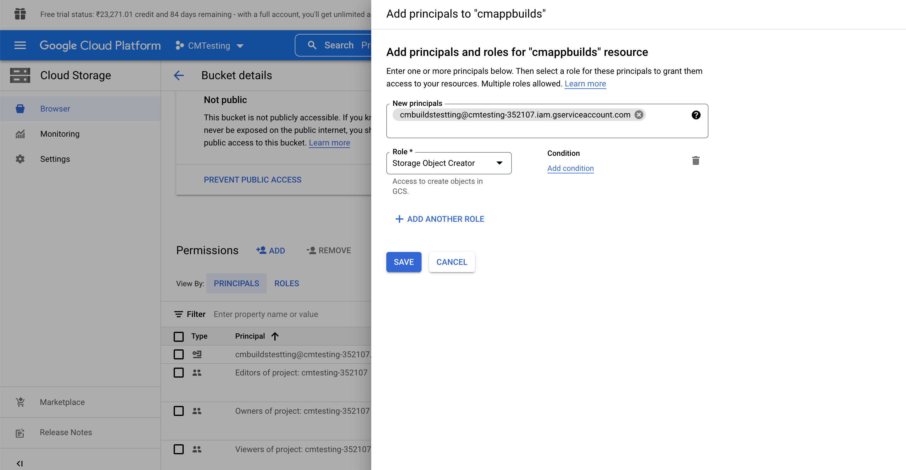

In order to publish your generated artifacts to Google Cloud Storage:

1. Log in to your Google Cloud platform [console](https://console.cloud.google.com/).

2. Create a new service account under **IAM & Admin > Service Accounts**.Find more information about how to create a service account [here](https://docs.codemagic.io/knowledge-base/google-services-authentication/#creating-a-service-account).

3. Generate a key as JSON for the service account. This will cause a JSON key file to be downloaded.

4. In the Codemagic web app you should create an environment variable called **GCLOUD_STORAGE_KEY** and add the contents of the Service Account JSON as its value. More information about environment variable groups can be found [here](https://docs.codemagic.io/variables/environment-variable-groups/).

5. Go to your Google Cloud Platform console and open Cloud Storage. Make a note of the name of the bucket you want to upload to or create a new bucket.

6. This step is optional, in case you have an existing bucket with necessary permissions.

   To set up permission go to the permission section of the bucket, Click on **+ Add** and add the service account details with the role of Storage Object Creator and click save.

   

7. Replace `gs://YOUR_BUCKET_NAME` with your own bucket name in the following script and add it as a post-publishing script or create a new script step if you are using codemagic.yaml:

```
echo $GCLOUD_STORAGE_KEY > $CM_BUILD_DIR/gcloud_storage_key.json
gcloud auth activate-service-account --key-file $CM_BUILD_DIR/gcloud_storage_key.json
gsutil cp $CM_BUILD_DIR/app/build/outputs/**/*.apk gs://YOUR_BUCKET_NAME
```

After completing steps above, you can go to your Cloud Storage account and check if the object is uploaded.
