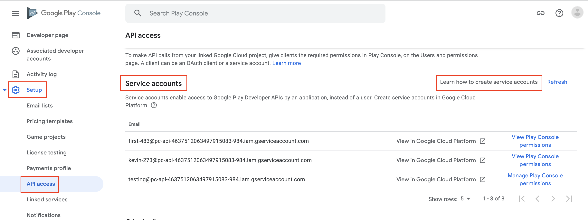
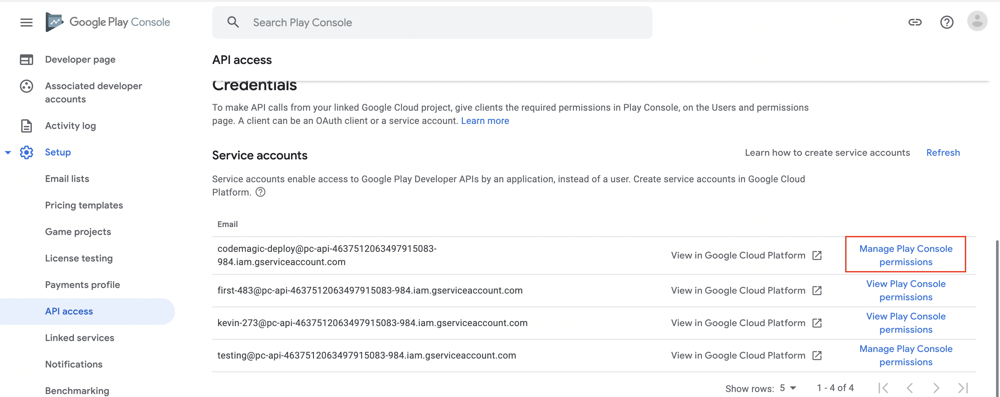
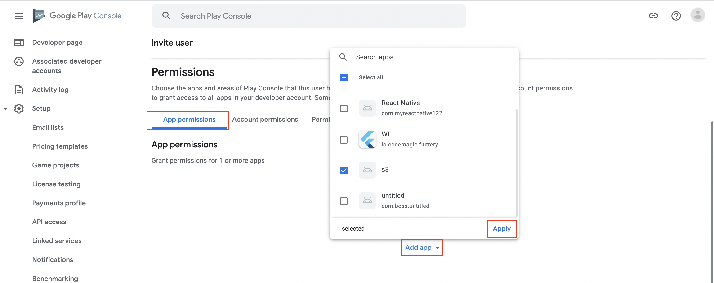
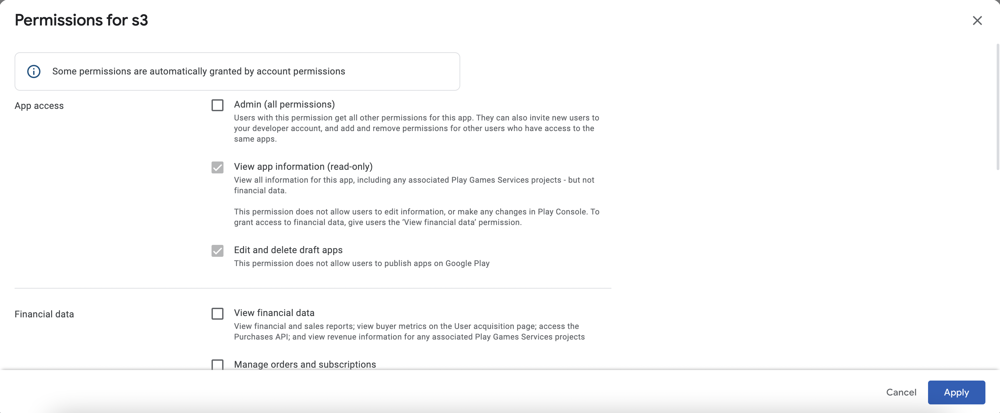
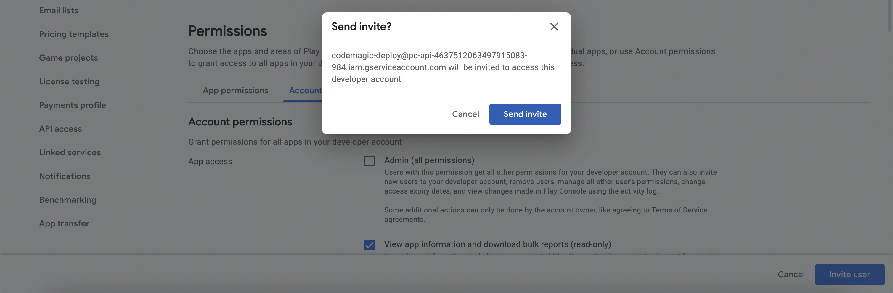

Codemagic enables you to automatically publish your android application to Google Play.


**Note:** This guide only applies to workflows configured with the **codemagic.yaml**. If your workflow is configured with **Flutter workflow editor** please go to [Publishing to Google Play using Flutter workflow editor](../publishing/publishing-to-google-play).
  



Codemagic enables you to automatically publish your app either to one of the predefined tracks on Google Play or to your custom closed testing tracks.

In order to do so, a service account is required when setting up publishing to Google Play. The service account JSON key file must be added to Codemagic to authenticate with these services.

## Configure Google Play API access

1. To allow Codemagic to publish applications to Google Play, it is necessary to set up access using Google Play API. 

2. In the Google Play Console, navigate to **Setup > API access** and click **Learn how to create service accounts**.  
This will lead you to the Google Cloud Platform. 

3. In step 1, fill in the **Service account details** and click **Create**. The name of the service account will allow you to identify it among other service accounts you may have created.

4. In step 2, click the **Select a role** dropdown menu and choose the role. In this example we will use **Service Account User** as the desired role. Start typing the name of the role that you wish to add.  

5. In step 3, you can leave the fields blank and click **Done**.

6. In the list of created service accounts, identify the account you have just created and click on the menu in the **Actions** column, then click **Manage keys**.  

7. In the Keys section, click **Add Key > Create new key**. Make sure that the key type is set to `JSON` and click **Create**. Save the key file in a secure location to have it available.  

8. Back in **Google Play Console**, navigate to **Setup > API access** and click **Manage Play Console permissions** next to the created account.  

9. On the **App permissions** tab, add the applications you wish to grant access to.  

10. Go with the default settings for app permissions and click **Apply** (financial data permissions can be left blank).   

11. On the **Account permissions** tab, leave everything as it is. (There is NO need to grant the service account **Admin** access).

12. Finally, click **Invite user** to finish setting up the service account on Google Play. In the Invite user window, the Email address field is pre-filled. Under Permissions, the default ones are already selected. You can go with these. Click Invite user at the bottom of the page.  

## Configure publishing in codemagic.yaml

Once you make all the preparations as described above and configure publishing to Google Play, Codemagic will automatically distribute the app to Google Play every time you build the workflow.


**Note:** The very first version of the app must be added to Google Play manually. You can download the **app_release.aab** from the build artifacts. In addition, each uploaded binary must have a different version; see how to automatically [increment build version](../building/build-versioning/ 'Build versioning') on Codemagic.


1. Save the contents of the `JSON` key file as a [secure environment variable](../variables/environment-variable-groups/#storing-sensitive-valuesfiles) in application or team settings:

    1. Open your Codemagic app settings, and go to the **Environment variables** tab.
    2. Enter the desired **_Variable name_**, e.g. `GCLOUD_SERVICE_ACCOUNT_CREDENTIALS`.
    3. Copy and paste the key file content as **_Variable value_**.
    4. Enter the variable group name, e.g. **_google_credentials_**. Click the button to create the group.
    5. Make sure the **Secure** option is selected.
    6. Click the **Add** button to add the variable.

    7. Add the variable group to your `codemagic.yaml` file
    
    environment:
        groups:
        - google_credentials
    

2. Configure publishing section in `codemagic.yaml` to publish to Google Play:


publishing:
  google_play:
    # Contents of the JSON key file for Google Play service account saved
    # as a secure environment variable
    credentials: $GCLOUD_SERVICE_ACCOUNT_CREDENTIALS
    
    # Name of the track internal, alpha, beta, production, internal app sharing,
    # or your custom track name
    track: alpha
    
    # Optional Priority of the release (only set if in-app updates are supported)
    # integer in range [0, 5]
    in_app_update_priority: 3

    # Optional. Rollout fraction (set only if releasing to a fraction of users)
    # value between (0, 1)
    rollout_fraction: 0.25

    # Optional boolean To be used ONLY if your app cannot be sent for review automatically *
    changes_not_sent_for_review: true

    # Optional boolean. Publish artifacts under a draft release.
    # Can not be used together with rollout_fraction. Defaults to false
    submit_as_draft: true


3. Codemagic enables you to automatically publish your app either to one of the tracks:
   - **Internal** --- publish for internal testing and QA
   - **Alpha** --- publish for testing with a small group of trusted users
   - **Beta** --- publish for testing to a wider set of users
   - **Production** --- release the app to production
   - **Custom** --- release the app to a custom closed testing track

4. If your application supports [in-app updates](https://developer.android.com/guide/playcore/in-app-updates), Codemagic allows setting the update priority. Otherwise, `in_app_update_priority` can be omitted or set to `0`.

5. In addition, Codemagic supports [staged releases](https://support.google.com/googleplay/android-developer/answer/6346149?hl=en), allowing users to choose which fraction of the testers or users get access to the application. To release to everyone, omit `rollout_fraction` from codemagic.yaml.

6. The field `changes_not_sent_for_review` is required if you are getting the error _**Changes cannot be sent for review automatically. Please set the query parameter changesNotSentForReview to true. Once committed, the changes in this edit can be sent for review from the Google Play Console UI.**_

7. If your changes are sent to review automatically, but the field is still set to `true`, you may get the error _**Changes are sent for review automatically. The query parameter changesNotSentForReview must not be set.**_

8. If you are getting a **400 error** related to the app being in draft status, either enable publishing to draft by setting the value of **submit_as_draft** to **true** or promote the draft build up by a level to one of the testing tracks. Play Console will show you how to do this. You'll need to go through the steps, fill out questionnaires, upload various screenshots, and then after approval, you can move to the Alpha testing track, and Codemagic will successfully publish.

9. To target "**Wear OS Only**" track, add **wear:** in the track name.

publishing:
  google_play:
    credentials: $GCLOUD_SERVICE_ACCOUNT_CREDENTIALS
    # targeting internal Wear OS Only track
    track: wear:internal



**Tip:** You can override the publishing track specified in the configuration file using the environment variable `GOOGLE_PLAY_TRACK`. This is useful if you're starting your builds via [Codemagic API](../rest-api/overview/) and want to build different configurations without editing the configuration file.



**Note:** To use different Google Play Console accounts for publishing your Android apps, set up separate workflows. 

